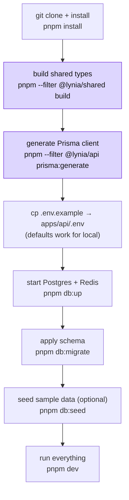

# Contributing to Lynia

This guide gets you from a fresh clone to a running local stack, and lays out how changes flow into
`main`. For *what* the system is and *how* it's wired, read [`docs/ARCHITECTURE.md`](docs/ARCHITECTURE.md)
first; for status and the founder wiring runbook, [`docs/PILOT-READINESS.md`](docs/PILOT-READINESS.md).

---

## 1. Prerequisites

| Tool | Version | Notes |
|---|---|---|
| Node.js | **≥ 22** | See `.nvmrc`; `nvm use` picks it up. |
| pnpm | **10.33.0** | The repo pins `packageManager`; `corepack enable` makes it match. |
| Docker + Compose | any recent | Runs local PostgreSQL (PostGIS) + Redis. |
| gstack | latest | **Required for AI-assisted work** (see below). |

> **gstack is mandatory for AI-assisted contributions.** A PreToolUse hook
> (`.claude/hooks/check-gstack.sh`) blocks skill use until it's installed per-developer:
> ```bash
> git clone --depth 1 https://github.com/garrytan/gstack.git ~/.claude/skills/gstack
> cd ~/.claude/skills/gstack && ./setup --team
> ```
> gstack is **not** vendored into the repo — it's gitignored and installed under `~/.claude`. See the
> root [`CLAUDE.md`](CLAUDE.md) for the sprint flow (Think → Plan → Design → Build → Review → Test → Ship).

---

## 2. Local setup (first run)



Step by step:

```bash
# 1. Install workspace deps
pnpm install

# 2. Build the shared contract package FIRST — every app imports its runtime values
pnpm --filter @lynia/shared build

# 3. Generate the Prisma client
pnpm --filter @lynia/api prisma:generate

# 4. Local env for the API (defaults in .env.example point at the compose services)
cp .env.example apps/api/.env

# 5. Bring up local infra (PostgreSQL + PostGIS, Redis)
pnpm db:up

# 6. Apply migrations (creates the PostGIS extension, hot-path constraints, GiST index)
pnpm db:migrate

# 7. (optional) seed demo data
pnpm db:seed

# 8. Run the workspaces in dev
pnpm dev
```

The `@lynia/shared` build in step 2 matters: `build`/`typecheck`/`test` all `dependsOn: ["^build"]` in
`turbo.json`, and the integration specs import shared **runtime** values (e.g. `ACTIVE_RIDE_STATUSES`),
so nothing typechecks or runs until shared is built.

### Local defaults

`.env.example` is pre-wired for the compose stack — `DATABASE_URL` and `REDIS_URL` already point at
`localhost`, `CLOUD_PROVIDER=gcp`, `PUSH_PROVIDER=noop` (logs instead of sending), `KYC_PROVIDER=stub`
(auto-passes, no Didit account), and `OTP_CHANNEL` can be set to `console` to print codes to the log.
**You need no cloud account and no external vendor keys to run the full flow locally.**

---

## 3. Everyday commands

Run from the repo root (Turborepo fans them across workspaces):

| Command | Does |
|---|---|
| `pnpm dev` | Run all workspaces in watch mode. |
| `pnpm build` | Build every workspace. |
| `pnpm typecheck` | Typecheck every workspace. |
| `pnpm test` | Run all test suites. |
| `pnpm lint` | Lint (several workspaces are no-op today). |
| `pnpm db:up` / `pnpm db:down` | Start / stop local Postgres + Redis. |
| `pnpm db:migrate` | Apply migrations (`prisma migrate deploy`). |
| `pnpm db:seed` | Seed demo data. |

Per-workspace (filter):

| Command | Does |
|---|---|
| `pnpm --filter @lynia/api start:dev` | Run just the API in watch mode. |
| `pnpm --filter @lynia/api test` | API unit tests (Vitest). |
| `pnpm --filter @lynia/api test:int` | API integration tests (needs a live PostGIS). |
| `pnpm --filter @lynia/api migrate:dev` | Create a new migration from schema changes. |
| `pnpm --filter @lynia/mobile start` | Expo dev server for the mobile app. |

### Changing the data model

1. Edit `apps/api/prisma/schema.prisma`.
2. `pnpm --filter @lynia/api migrate:dev --name <change>` to author the migration.
3. If you touch a hot-path constraint (the `one_active_ride` partial index, the GiST geo index, the
   hashed OTP), hand-edit the generated SQL to match `migrations/0001_init` — those are raw SQL, and
   **CI re-asserts they applied** (see below).
4. Keep the Prisma enums and `packages/shared/src/enums.ts` **in lockstep** — they're mirror copies.

---

## 4. Contribution flow

```mermaid
graph LR
    branch["branch off main<br/>feature/… or claude/…"]
    change["make the change<br/>+ tests"]
    verify["local gate:<br/>typecheck · build · test"]
    pr["open PR → main"]
    ci["CI: build + schema jobs"]
    review["review"]
    merge["squash/merge to main"]
    deploy["release.yml → Cloud Run<br/>(armed, non-docs changes)"]

    branch --> change --> verify --> pr --> ci --> review --> merge --> deploy

    classDef gate fill:#fecaca,stroke:#b91c1c,color:#111;
    class ci,verify gate;
```



- **Branch** off `main`; never commit straight to it.
- **Before pushing**, run the same gate CI will: `pnpm typecheck && pnpm build && pnpm test`.
- **Open a PR** into `main`. Keep it scoped; write a description that explains the *why*.
- **CI must be green** (next section) before merge.
- **Docs-only changes** (`docs/**`, `**.md`) skip the deploy — the release workflow's `paths-ignore`
  makes them a no-op for Cloud Run.

---

## 5. What CI checks

[`.github/workflows/ci.yml`](.github/workflows/ci.yml) runs on every PR and push to `main`, in two jobs:

| Job | What it does |
|---|---|
| **build** | `pnpm install` → build `@lynia/shared` → `prisma:generate` → `typecheck` → `build` → API `test`, across all workspaces. |
| **schema** | Spins up a **real PostGIS service**, runs `migrate:deploy`, then **asserts the offer-loop constraints actually applied** — `one_active_ride`, the GiST geo index, and the hashed delivery OTP. |

The schema job is the important one to understand: the correctness of the offer loop rests on those DB
constraints ([ARCHITECTURE §13](docs/ARCHITECTURE.md#13-concurrency-safety-model)), so CI proves they
exist on every change rather than trusting the migration.

[`release.yml`](.github/workflows/release.yml) builds and deploys the API container to Cloud Run on
merges to `main` — but only when a maintainer has armed it (`GCP_DEPLOY_ENABLED == 'true'`). Until
then it's a clean no-op.

---

## 6. Project conventions

- **Shared contracts are the source of truth.** Wire shapes are zod schemas in
  `packages/shared/src/contracts.ts`; import the inferred types on both ends rather than redeclaring.
- **Match the surrounding code.** Comment density, naming, and idiom vary by file — read the neighbours
  before adding.
- **Business logic stays cloud-agnostic.** Anything cloud-specific (storage, secrets, push) goes behind
  an adapter interface in `apps/api/src/adapters` — never call a cloud SDK from a feature module.
- **Contended state uses a guarded CAS**, not check-then-act. Put the guard in the `WHERE` clause of the
  write and let the DB arbitrate the race (see the concurrency section of the architecture doc).
- **Never store secrets in plaintext.** OTP codes, refresh tokens, and delivery codes are HMAC-hashed;
  follow the same pattern for anything new.

---

## 7. Where things live

| Area | Path |
|---|---|
| Backend (NestJS) | `apps/api/` |
| Mobile (Expo) | `apps/mobile/` |
| Admin console (Next.js) | `apps/admin/` |
| Shared contracts / enums / pricing | `packages/shared/src/` |
| DB schema + migrations | `apps/api/prisma/` |
| Cloud infra (Terraform) | `infra/terraform/` |
| CI / release | `.github/workflows/` |
| Architecture & design docs | `docs/` |

Welcome aboard — start with [`docs/ARCHITECTURE.md`](docs/ARCHITECTURE.md) and the offer-loop sequence,
which is the one flow the whole product turns on.
</content>
