# Lynia — Architecture

On-demand motorbike courier for Zimbabwe, built around an inDrive-style **offer loop**:
the customer names a price, nearby riders accept or counter, the customer picks one, and the
trip runs through an OTP-gated delivery lifecycle with live tracking.

This document is the engineering map of the system: how the pieces fit, where the data lives,
how the hard flows work, and how it deploys. It complements the product/plan docs
([CONCEPT](CONCEPT.md), [ENG-REVIEW](ENG-REVIEW.md), [PILOT-READINESS](PILOT-READINESS.md)) —
those cover *why*; this covers *how it is wired*.

> Diagrams are [Mermaid](https://mermaid.js.org/). GitHub renders them inline; in an editor use a
> Mermaid preview extension.

---

## Table of contents

- **[Master architecture diagram](#master-architecture-diagram)** — everything on one canvas
1. [System context](#1-system-context)
2. [Monorepo layout](#2-monorepo-layout)
3. [Deployment topology (GCP)](#3-deployment-topology-gcp)
4. [API module map (NestJS)](#4-api-module-map-nestjs)
5. [Data model (ERD)](#5-data-model-erd)
6. [The offer loop (core sequence)](#6-the-offer-loop-core-sequence)
7. [Order lifecycle state machine](#7-order-lifecycle-state-machine)
8. [Authentication (OTP + JWT sessions)](#8-authentication-otp--jwt-sessions)
9. [Rider onboarding & KYC](#9-rider-onboarding--kyc)
10. [Live tracking (WebSocket)](#10-live-tracking-websocket)
11. [Media uploads (signed URLs)](#11-media-uploads-signed-urls)
12. [The cloud-portable adapter seam](#12-the-cloud-portable-adapter-seam)
13. [Concurrency-safety model](#13-concurrency-safety-model)
14. [Background jobs & self-healing](#14-background-jobs--self-healing)
15. [CI / CD pipeline](#15-ci--cd-pipeline)
16. [REST + WebSocket surface](#16-rest--websocket-surface)

---

## Master architecture diagram

One canvas: clients, the API's edge + feature lanes + adapter seam + background workers, every data
store (with the load-bearing schema constraints called out), the external vendors, and the labeled
data-flow paths between them. Boxes are components/stores; solid arrows are the primary request/data
paths (labeled with what flows); dotted arrows are best-effort or out-of-band paths.

The individual sections below zoom into each region ([deployment](#3-deployment-topology-gcp),
[modules](#4-api-module-map-nestjs), [data model](#5-data-model-erd),
[concurrency](#13-concurrency-safety-model)); this is the whole thing at a glance.

```mermaid
flowchart TB
    %% ===================== Clients =====================
    subgraph CLIENTS["Clients"]
        direction LR
        CUST["📱 Customer app<br/>Expo / RN"]
        RIDER["🏍️ Rider app<br/>Expo / RN"]
        ADMIN["🖥️ Admin console<br/>Next.js"]
    end

    %% ===================== External vendors =====================
    subgraph EXT["External integrations (behind adapters)"]
        direction LR
        WA["WhatsApp Cloud API<br/>OTP send"]
        FCM["Firebase Cloud Messaging<br/>push"]
        DIDIT["Didit<br/>ID / KYC"]
    end

    %% ===================== API =====================
    subgraph API["@lynia/api · NestJS on Cloud Run (fronted by HTTPS ALB)"]
        direction TB
        subgraph EDGE["Edge"]
            direction LR
            REST["REST controllers<br/>JWT / admin guard"]
            GW["Socket.IO<br/>TrackingGateway"]
        end
        subgraph FEAT["Feature lanes"]
            direction LR
            AUTH["Auth<br/>OTP · JWT · sessions"]
            OFF["Offers<br/>make · list"]
            MATCH["Matching<br/>select offer"]
            LIFE["Lifecycle<br/>advance · deliver · rate · cancel"]
            RID["Riders<br/>onboard · online"]
            KYCM["KYC<br/>webhook · admin override"]
            TRK["Tracking<br/>geo · access checks"]
            NOTIF["Notifications<br/>push + device tokens"]
            UP["Uploads<br/>signed URLs"]
            ADM["Admin read API"]
        end
        subgraph SEAM["Cloud adapter seam (D7)"]
            direction LR
            STO["StorageAdapter"]
            PSH["PushAdapter"]
        end
        subgraph JOBS["Background workers (BullMQ + reconciler)"]
            direction LR
            QEXP["offer-expiry"]
            QAC["rating auto-close"]
            RECON["DB reconciler<br/>15-min sweep"]
        end
    end

    %% ===================== Data stores =====================
    subgraph STORE["Data stores"]
        direction TB
        subgraph PG["PostgreSQL + PostGIS"]
            direction LR
            TORD["orders<br/>🔒 one_active_ride<br/>🔒 otp_hash (hashed)"]
            TOFF["offers<br/>🔒 unique(order,rider)"]
            TRID["riders<br/>geog · GiST index"]
            TPRO["profiles · sessions<br/>device_tokens"]
            TEVT["order_events · ratings"]
        end
        REDIS[("Redis<br/>OTP + rate-limit ·<br/>BullMQ · WS pub/sub")]
        GCS[["Object storage<br/>KYC / item photos"]]
    end

    %% ---------- Clients → API ----------
    CUST -->|"REST: create order · select offer · rate"| REST
    RIDER -->|"REST: make offer · advance · deliver OTP"| REST
    ADMIN -->|"admin JWT (read)"| REST
    CUST <-->|"WS: order:status · position"| GW
    RIDER -->|"WS: rider:location"| GW

    %% ---------- Clients → storage (direct upload) ----------
    CUST -.->|"PUT bytes (signed URL)"| GCS
    RIDER -.->|"PUT bytes (signed URL)"| GCS

    %% ---------- Edge → lanes ----------
    REST --> AUTH & OFF & MATCH & LIFE & RID & KYCM & NOTIF & UP & ADM
    GW --> TRK

    %% ---------- Lanes → stores (labeled data flow) ----------
    AUTH -->|"sessions · hashed OTP/refresh"| TPRO
    AUTH -->|"OTP store · rate-limit counters"| REDIS
    OFF -->|"insert (one round)"| TOFF
    MATCH -->|"guarded CAS → assigned"| TORD
    MATCH -->|"schedule 90s expiry"| REDIS
    LIFE -->|"guarded CAS · row-lock OTP verify"| TORD
    LIFE -->|"schedule rating auto-close"| REDIS
    RID --> TRID
    KYCM -->|"monotonic update (kycRef)"| TRID
    TRK -->|"ST_DWithin nearby · update geog"| TRID
    NOTIF -->|"device tokens"| TPRO
    UP --> STO
    ADM -->|"read counts / lists"| PG
    MATCH --> TEVT
    LIFE --> TEVT

    %% ---------- Background workers ----------
    REDIS --> QEXP -->|"expire (idempotent CAS)"| TORD
    REDIS --> QAC -->|"complete"| TORD
    RECON -->|"close stale delivered"| TORD

    %% ---------- Realtime fan-out ----------
    LIFE -.->|"emitOrderStatus"| GW
    GW <-.->|"Socket.IO adapter fan-out"| REDIS

    %% ---------- Adapter seam → cloud/vendors ----------
    STO --> GCS
    NOTIF --> PSH --> FCM
    AUTH -->|"send code"| WA

    %% ---------- KYC integration ----------
    RID -->|"create verification session"| DIDIT
    DIDIT -->|"HMAC webhook → /kyc/callback"| REST

    %% ===================== Styles =====================
    classDef ext fill:#fde68a,stroke:#b45309,color:#111;
    classDef store fill:#bbf7d0,stroke:#15803d,color:#111;
    classDef safe fill:#fee2e2,stroke:#b91c1c,color:#111,stroke-width:2px;
    classDef client fill:#bfdbfe,stroke:#1d4ed8,color:#111;
    class WA,FCM,DIDIT ext;
    class REDIS,GCS,TPRO,TEVT store;
    class TORD,TOFF,TRID safe;
    class CUST,RIDER,ADMIN client;
```

**How to read it:**

- **🔒 red boxes** are the tables whose database constraints make the offer loop correct — `orders`
  (the `one_active_ride` partial-unique index + the hashed delivery `otp_hash`), `offers` (the
  `unique(order, rider)` one-round rule), and `riders` (the `geog` GiST index). Edge labels like
  *"guarded CAS"* and *"row-lock OTP verify"* mark exactly where contended writes are serialized —
  full detail in [§13](#13-concurrency-safety-model).
- **Green boxes** are data stores; **Redis** wears three hats (OTP + rate-limit counters, the BullMQ
  job queues, and the Socket.IO pub/sub fan-out across API instances).
- **Amber boxes** are the external vendors — all reached through the adapter seam
  ([§12](#12-the-cloud-portable-adapter-seam)), except the Didit KYC webhook which posts back in.
- **Solid arrows** are primary request/data paths (labeled with what flows); **dotted arrows** are
  best-effort or out-of-band (WS status fan-out, direct-to-storage uploads, push).
- Note the two **direct-to-storage** dotted paths: photo bytes never transit the API — clients PUT to
  object storage via a short-lived signed URL ([§11](#11-media-uploads-signed-urls)).

---

## 1. System context

Who talks to Lynia and across which channels. The mobile app is the customer/rider surface; the
admin console is an internal read/support tool. The API is an owned NestJS service (no BaaS) that
integrates with three external providers behind adapters.

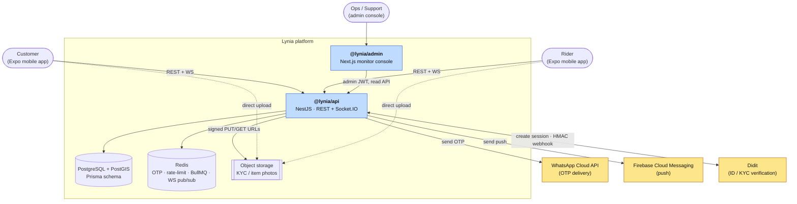

Design rule that shapes everything downstream: **the API owns its data and business logic; every
cloud-specific capability (storage, secrets, push) is reached through an adapter interface**, so the
cloud is a `CLOUD_PROVIDER` switch rather than a rewrite ([§12](#12-the-cloud-portable-adapter-seam)).

---

## 2. Monorepo layout

pnpm workspaces + Turborepo. `packages/shared` is the contract layer every app imports, which is
what keeps the wire shape from drifting between the API and its clients.

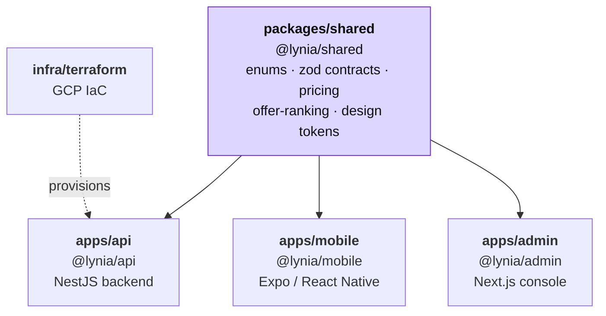

| Workspace | Package | Stack | Role |
|---|---|---|---|
| `packages/shared` | `@lynia/shared` | TypeScript, zod | Domain enums, API contracts (zod schemas + inferred types), suggested-fare pricing, offer-ranking, design tokens. Single source of truth, built first. |
| `apps/api` | `@lynia/api` | NestJS, Prisma, Socket.IO, BullMQ | The backend: auth, offer loop, lifecycle, tracking, KYC, admin read API, cloud adapters, OpenTelemetry. |
| `apps/mobile` | `@lynia/mobile` | Expo (React Native), expo-router, React Query, socket.io-client | Android-first customer + rider app. |
| `apps/admin` | `@lynia/admin` | Next.js (App Router, server components) | Internal monitor/support console. |
| `infra/terraform` | — | Terraform | GCP provisioning (Cloud Run, Cloud SQL, Memorystore, GCS, Secret Manager, ALB, WIF). |

Turborepo wires the task graph: `build`/`typecheck`/`test` all `dependsOn: ["^build"]`, so
`@lynia/shared` compiles before any app that imports it.

---

## 3. Deployment topology (GCP)

Provisioned by Terraform in `africa-south1` (Johannesburg). The org disables the default
`*.run.app` URL and service-account key creation, which drives two of the more unusual choices: an
external HTTPS load balancer in front of Cloud Run for a stable device-facing endpoint, and keyless
CI via Workload Identity Federation.

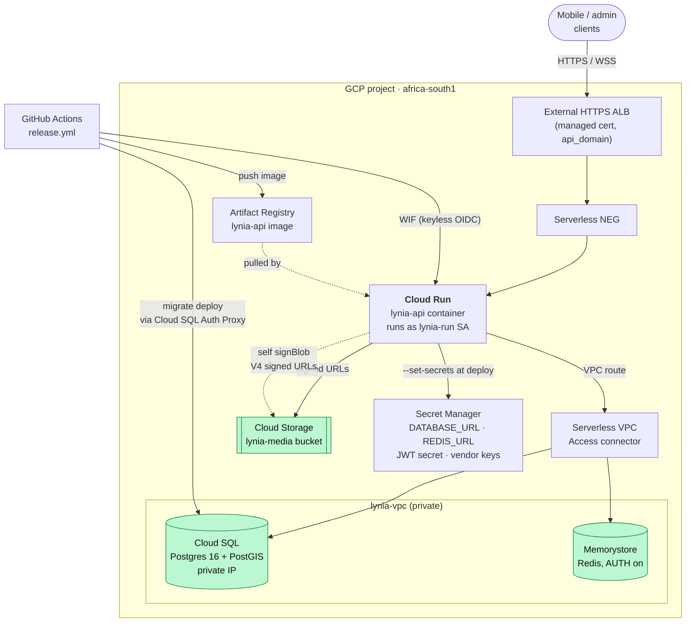

Key facts:

- **Cloud Run** is the only compute; it has no VPC route by default, so the **Serverless VPC Access
  connector** is what lets it reach private-IP Redis (and is why it exists at all).
- **Secrets** are injected as env vars at deploy time (`--set-secrets`), not read via a managed
  identity SDK — that keeps the app cloud-neutral (D7). GCS signing uses the runtime SA's `signBlob`
  IAM permission (ADC), so **no private key lives in env**.
- **CI auth is keyless**: Workload Identity Federation, OIDC scoped to the repo. The org disables SA
  key creation, so there is no JSON key to leak.
- The **ALB → Cloud Run hop is plain HTTP**; user-facing TLS terminates at the ALB's managed cert.
  The Socket.IO tracking connection's max lifetime is governed by Cloud Run's own request timeout
  (`--timeout 3600`), not the LB.

The Azure Blob / env-secrets adapter implementations are retained as the **portability proof**
([§12](#12-the-cloud-portable-adapter-seam)).

---

## 4. API module map (NestJS)

Modules are grouped into "lanes" (the plan's workstreams). `ConfigModule` and `PrismaModule` are
global infrastructure; the three adapter modules form the cloud seam; everything else is a feature
lane. Arrows are the dependency direction (who injects whom).

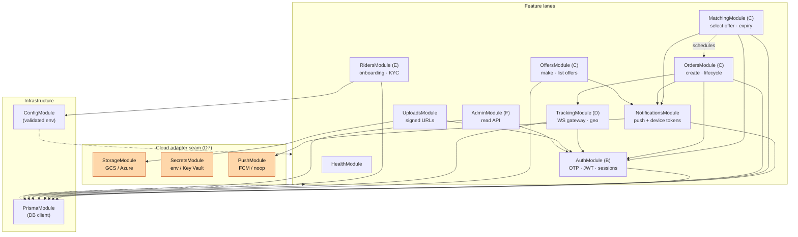

Notable cross-module wiring:

- **`MatchingModule`** injects `TokenService` (to mint the delivery OTP) and `NotificationsService`.
- **`OrderLifecycleService`** (in `OrdersModule`) injects the `TrackingGateway` so a committed status
  change fans out over WebSockets, plus `NotificationsService` for push — both best-effort.
- **`OffersModule`** and **`MatchingModule`** are the two halves of the offer loop; both write the
  `orders`/`offers` tables under the same concurrency guards ([§13](#13-concurrency-safety-model)).

Bootstrap (`main.ts`) initializes OpenTelemetry **before** the Nest app (so HTTP is patched before
the server starts), enables `rawBody` (needed to HMAC-verify the Didit webhook against the unparsed
body), and enables shutdown hooks (so BullMQ workers close cleanly).

---

## 5. Data model (ERD)

Prisma owns the schema and the typed client. The hot-path constraints and the PostGIS geography
column are driven by raw SQL in `migrations/0001_init`. `Merchant` and `Address` are reserved
super-app seams, unused at launch.

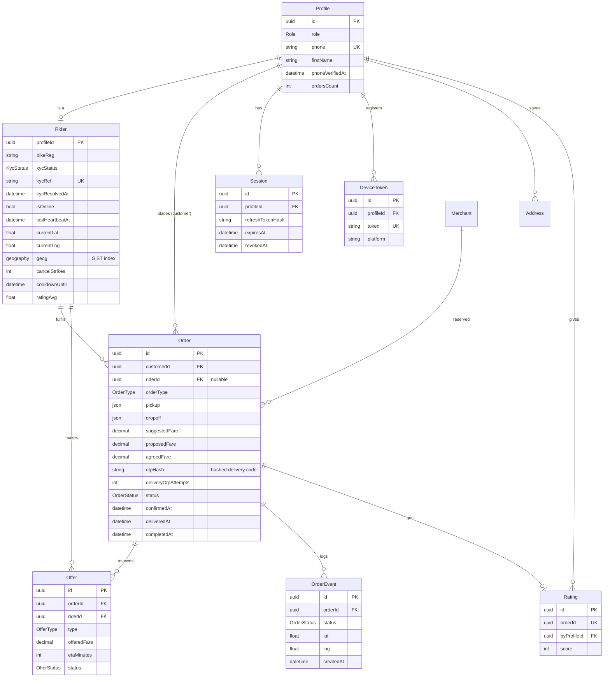

Load-bearing schema invariants (all enforced in the database, not just app code):

| Constraint | What it guarantees |
|---|---|
| `one_active_ride` — partial-unique index on `orders(rider_id)` over active statuses | A rider can be on **at most one active ride** at a time. The DB rejects a double-assign even under a race (ET2). |
| `offers` unique `(order_id, rider_id)` | **One offer per rider per order** — the "one round" rule as a constraint (ET7). |
| `riders_geog_gist` — GiST on `geog geography(Point,4326)` | Fast nearby-rider radius search via `ST_DWithin` (ET6). |
| `orders.otp_hash` (never plaintext) + `delivery_otp_attempts` | Delivery handover code is stored only as an HMAC hash, with a 5-attempt cap (ET7). |
| `sessions.refreshTokenHash` (hashed) + `revokedAt` | Server-owned sessions → real revoke/logout/ban (ET5). |

---

## 6. The offer loop (core sequence)

This is the heart of the product and the trickiest concurrency surface. A customer broadcasts a
price; online, KYC-verified riders respond once each; the customer selects one; assignment is a
**guarded compare-and-swap** so a concurrent select and the expiry timer can never double-assign.

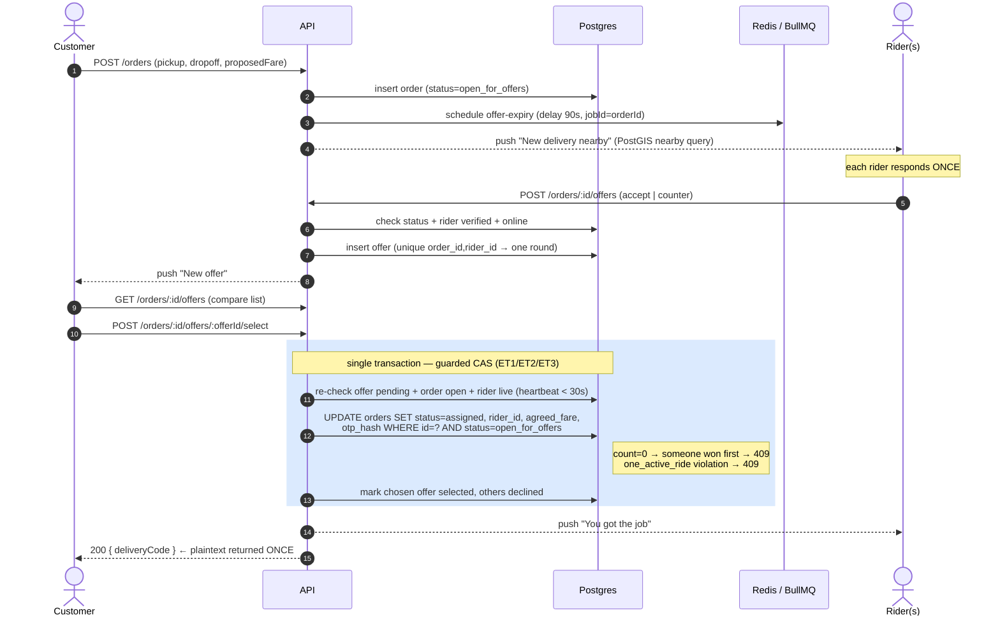

What makes the select safe:

- The `UPDATE ... WHERE status = 'open_for_offers'` is the CAS. **First writer wins**; a second
  concurrent select (or the expiry job firing at the same instant) sees `count = 0` and returns a
  409, so the order can never be assigned twice.
- The `one_active_ride` index makes the DB reject a rider who is somehow selected on two orders at
  once (caught as a `P2002` → 409).
- **Liveness is checked inside the transaction**: the selected rider must be `isOnline` with a
  heartbeat newer than 30s, or the select is rejected ("pick another").
- The **delivery code is minted here, hashed, and stored**; the plaintext is returned to the
  selecting customer exactly once and never persisted or re-exposed.
- The expiry path (`expireOrder`) runs the *same* guarded CAS: if a customer already selected, the
  order is no longer `open_for_offers`, so the expiry no-ops. Idempotent by construction.

---

## 7. Order lifecycle state machine

After assignment, the rider drives the trip forward one step at a time. Each forward edge is its own
guarded CAS (flips only from the expected prior state, and only for the assigned rider), so a
duplicate tap or a concurrent call can never skip or repeat a step. `delivered` is OTP-gated;
`completed` is reached by a customer rating **or** the auto-close backstop.

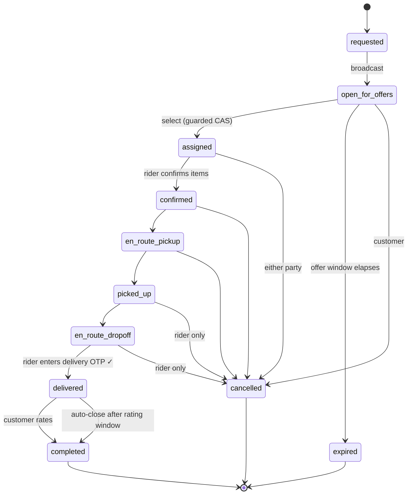

Rules encoded around the transitions:

- **Delivery OTP**: `confirmDelivery` takes a row lock (`SELECT ... FOR UPDATE`) so the attempt-count
  gate, the constant-time hash compare, and the increment are point-in-time consistent — no
  concurrent-guess bypass of the 5-attempt cap. A wrong code is **committed** (the increment
  persists); only the error path rolls back. After a lockout the customer can `rotate` a fresh code.
- **Cancellation windows** differ by party: a customer may cancel up to `en_route_pickup` (before the
  parcel is collected); a rider may cancel any time before `delivered`. A **rider cancel is a
  no-show strike** — every 3rd strike forces the rider offline on a 2-hour cooldown (T4).
- **Rating closes the order** and updates the rider's running `ratingAvg`/`ratingCount`/`tripsCount`
  in the same transaction. If the customer never rates, the auto-close backstop still completes the
  order so metrics don't stall ([§14](#14-background-jobs--self-healing)).
- Every transition writes an `order_event` row (the audit/tracker trail) and best-effort emits a WS
  `order:status` event plus an FCM push.

---

## 8. Authentication (OTP + JWT sessions)

Phone-first, passwordless. A one-time code (WhatsApp / SMS / console) proves phone ownership;
the API then issues a short-lived access JWT plus a **server-stored, rotating refresh token** so
logout/revoke/ban are real. OTP codes and refresh secrets are only ever stored as HMAC hashes.

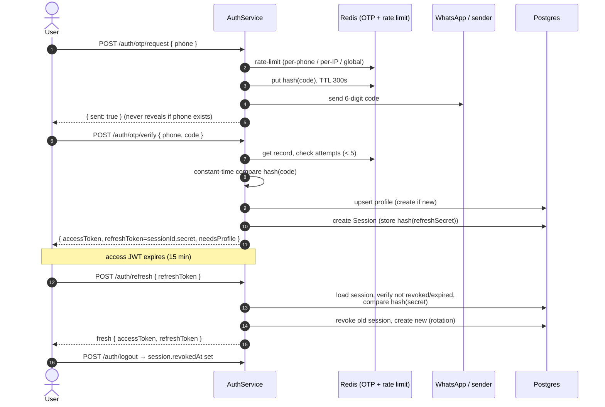

Security properties baked in:

- **Access token** = HS256 JWT, 15-min TTL, carries `sub` (profileId) + `role`; role is re-checked
  server-side per request, never trusted blindly.
- **Refresh token** = `sessionId.secret`; only `hash(secret)` is stored. Every refresh **rotates**
  (old session revoked, new one minted), so a stolen-and-replayed refresh token is detectable.
- **Rate limiting** on OTP send is three-tiered (phone / IP / global) because each WhatsApp send
  costs money — enumeration is a budget-DoS, not just spam (ET5).
- The **response never reveals whether a phone exists** (always "sent"). A dev/QA escape hatch
  returns the code inline, but only on the `console` channel and only for allowlisted test numbers.
- On the client, `apiFetch` **single-flights concurrent 401 refreshes** so two pollers don't both
  refresh (the second would use a token the first just rotated away and trigger a false sign-out).

---

## 9. Rider onboarding & KYC

A customer upgrades to a rider by submitting bike details + a photo; ID verification runs through
Didit (Zimbabwean national IDs). The webhook is HMAC-verified and applied **monotonically** so a
replayed or out-of-order delivery can't overwrite a newer decision. `KYC_MODE` and `KYC_PROVIDER`
switch between real vendor, manual admin review, and a CI/QA stub.

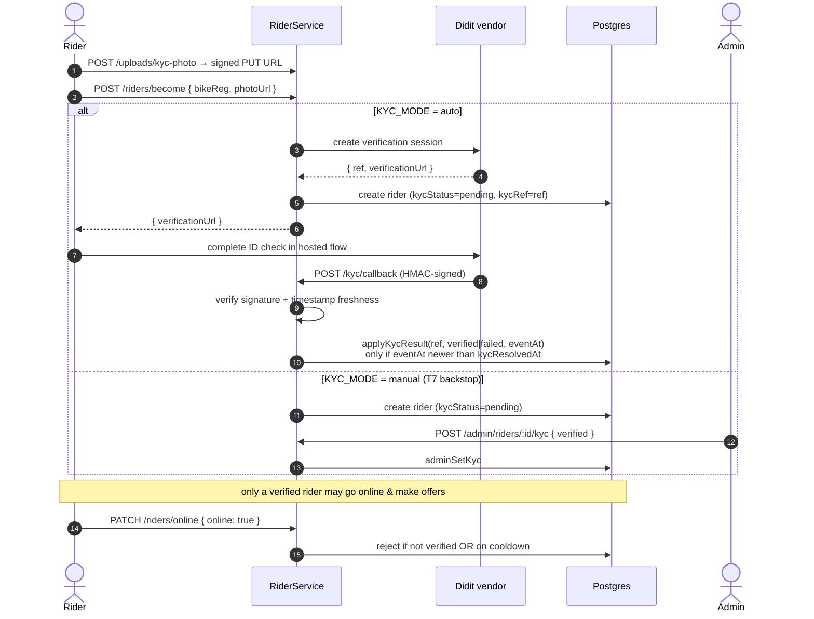

- **Gating**: `PATCH /riders/online` and `POST /orders/:id/offers` both require `kycStatus=verified`
  (and not on cooldown / actually online). An unverified or offline rider's offer is un-selectable
  anyway, so it's rejected up front.
- **Webhook idempotency**: `applyKycResult` updates only when `kycResolvedAt` is null or older than
  the incoming `eventAt`. `kycRef` is unique → matches at most one rider. An exact replay has the
  same timestamp → not newer → ignored.
- **Signature**: the webhook body is canonicalized (recursive key sort) and HMAC-verified against the
  raw request body (why `rawBody` is enabled at bootstrap), with a timestamp-freshness check.
- **Stub provider** (`KYC_PROVIDER=stub`, default) auto-passes in `auto` mode, so the full rider flow
  (online → bid → deliver → OTP) is testable in CI with no Didit account. Flip to `didit` before launch.

---

## 10. Live tracking (WebSocket)

A Socket.IO gateway pushes rider position and order-status changes to whoever is watching an order.
**WS is best-effort push only** — `GET /orders/:id` (REST) stays the source of truth on reconnect,
so a dropped socket self-heals via refetch. The Redis adapter fans events across API instances.

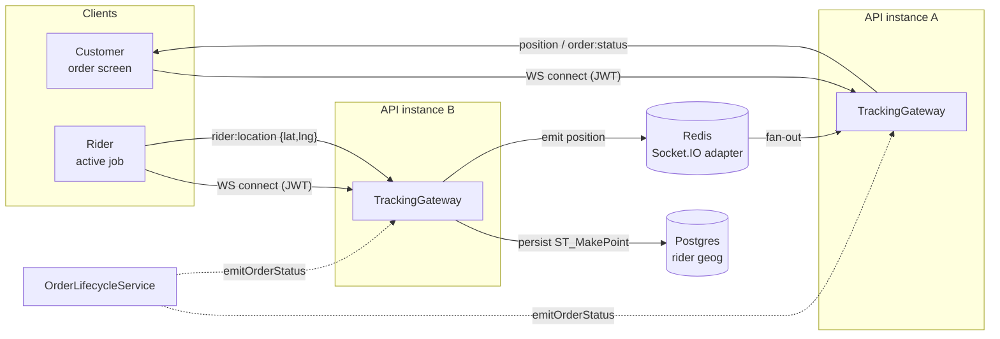

Flow details:

- **Connection auth**: the socket verifies the access JWT on connect (from `auth.token` or the
  `Authorization` header); an invalid/missing token is disconnected immediately.
- **`subscribe:order`**: server checks the caller is the order's customer *or* its assigned rider
  before joining the room (`canAccessOrder`).
- **`rider:location`**: only the **assigned rider on an active ride** may stream position
  (`isAssignedRider`). The position is persisted (`geog = ST_SetSRID(ST_MakePoint(...))`) so a
  reconnecting client's REST snapshot is fresh, then re-emitted to the room.
- **`order:status`**: emitted by the lifecycle service after a committed transition — wrapped so it
  can never throw into the caller's transaction.
- On the client, `useOrderSocket` applies `position` pushes to the React Query cache and, on
  connect / `order:status` / connect-error, **invalidates and refetches** the REST snapshot (the
  authoritative source). The screen also polls during active statuses as a second safety net.

---

## 11. Media uploads (signed URLs)

Photos (rider KYC/selfie, item photos) never transit the API — clients upload bytes **directly** to
object storage using a short-lived signed PUT URL. Only the resulting object key is persisted; read
URLs are minted on demand later.

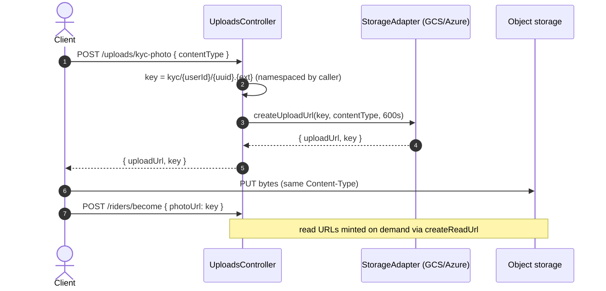

- The key is **namespaced by the authenticated user** (`kyc/{userId}/...`), so one rider can't target
  another's path.
- The signed URL pins the **exact `Content-Type`** (only `image/jpeg` / `image/png`, matching what
  `expo-image-picker` yields), so a URL is never valid for arbitrary payloads and the PUT signature
  won't match a different type.

---

## 12. The cloud-portable adapter seam

The three things a cloud actually locks you into — object storage, secret access, and push — sit
behind interfaces. Business logic depends only on the interface; the concrete impl is chosen by env
(`CLOUD_PROVIDER` / `PUSH_PROVIDER`). GCP is live; the Azure/env implementations are kept as the
**portability proof** that swapping clouds is a config change, not a rewrite (D7).

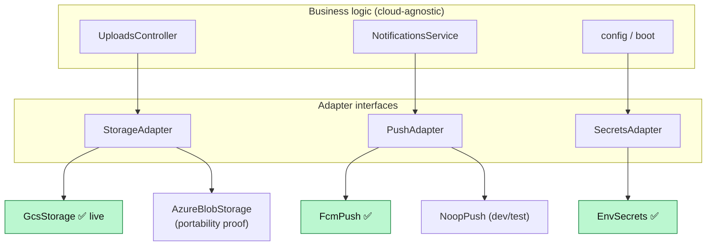

| Seam | Interface | Impls | Selector |
|---|---|---|---|
| Storage | `StorageAdapter` (`createUploadUrl`, `createReadUrl`) | `GcsStorage`, `AzureBlobStorage` | `CLOUD_PROVIDER` |
| Push | `PushAdapter` (`sendEach`, batched ≤500) | `FcmPush`, `NoopPush` | `PUSH_PROVIDER` |
| Secrets | `SecretsAdapter` | `EnvSecrets` (secrets injected as env at deploy) | — |

Because secrets arrive as **env vars injected at deploy** rather than through a managed-identity SDK,
there is no cloud-specific secret-fetch code in the app at all — the most subtle lock-in avoided.

---

## 13. Concurrency-safety model

Every state change that two actors could race is a **guarded compare-and-swap inside a
transaction**, backed by a **database constraint** as the last line of defense. This single pattern
recurs across the offer loop, the lifecycle, and the KYC webhook — it's the backbone of correctness.

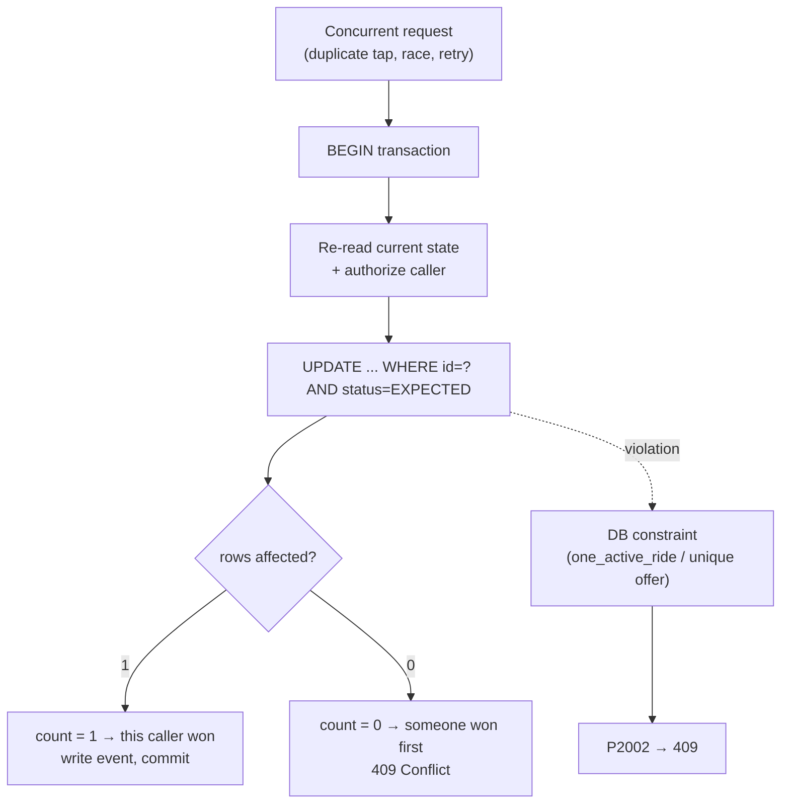

Where the pattern is applied:

| Operation | Guard | Backstop constraint |
|---|---|---|
| Select offer → assign | `UPDATE orders ... WHERE status='open_for_offers'` | `one_active_ride` partial-unique |
| Offer window expiry | same CAS (`WHERE status='open_for_offers'`) | idempotent job (`jobId=orderId`) |
| Make offer | insert with unique `(order_id, rider_id)` | rejects a second offer as 409 |
| Forward lifecycle step | `UPDATE ... WHERE status=<prior>` + rider check | one event row per real transition |
| Delivery OTP | `SELECT ... FOR UPDATE` row lock | 5-attempt cap, constant-time compare |
| Rate → complete | `UPDATE ... WHERE status='delivered'` | one `Rating` per order (unique) |
| KYC webhook | `updateMany ... WHERE kycResolvedAt < eventAt` | monotonic by event time |

The rule of thumb the codebase follows: **check-then-act is never split across statements** for
contended state — the guard lives in the `WHERE` clause of the write, so the database arbitrates the
race, and a unique index catches anything the guard misses.

---

## 14. Background jobs & self-healing

Two BullMQ queues (on Redis) drive time-based transitions, each paired with a **Redis-independent DB
backstop** so a lost job or a Redis outage can't strand an order.

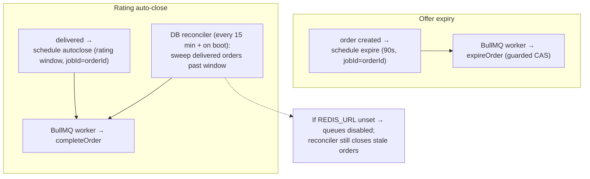

- **`jobId = orderId`** makes both jobs idempotent — a retry or duplicate schedule can't fire the
  transition twice.
- The **rating auto-close reconciler** runs on boot and every 15 minutes, sweeping any
  delivered-but-unrated order past the rating window (batched, 500 at a time). It's the self-healing
  backstop for a crash between commit and schedule, or a Redis outage — completion metrics never
  stall on an un-rated order (T3).
- If `REDIS_URL` is unset entirely, offer-expiry is disabled (logged) but the reconciler still
  closes stale deliveries — the system degrades, it doesn't break.

---

## 15. CI / CD pipeline

Two GitHub Actions workflows. **CI** gates every PR/push; **Release** ships the API container to
Cloud Run (dormant until a maintainer arms it post-provisioning).

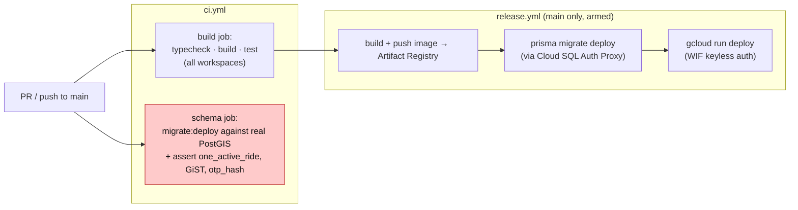

- The **schema job runs migrations against a real PostGIS service** and then asserts the
  offer-loop constraints actually applied (`one_active_ride`, the GiST geo index, the hashed
  delivery OTP) — the constraints are load-bearing, so CI proves them on every change.
- **Release** is gated on `GCP_DEPLOY_ENABLED == 'true'`: until a maintainer arms it, the workflow is
  a clean no-op that never fails a push. It skips on docs-only changes (`paths-ignore`).
- Auth is **keyless** (Workload Identity Federation); app runtime secrets live in Secret Manager and
  are injected at deploy via `--set-secrets`.

---

## 16. REST + WebSocket surface

The full API surface, by module. All routes except `/auth/otp/*`, `/auth/refresh`, `/kyc/callback`,
and `/healthz` require a bearer access token; admin routes additionally require the `admin` role.

### REST

| Method & path | Module | Purpose |
|---|---|---|
| `POST /auth/otp/request` | Auth | Send an OTP to a phone (rate-limited) |
| `POST /auth/otp/verify` | Auth | Verify OTP → issue session; upsert profile |
| `POST /auth/refresh` | Auth | Rotate refresh token → new session |
| `POST /auth/logout` | Auth | Revoke the current session |
| `GET /auth/me` | Auth | Authenticated profile (+ rider record) |
| `POST /orders` | Orders | Create a delivery, name a price → `open_for_offers` |
| `GET /orders/open` | Orders | Open orders a rider can bid on |
| `GET /orders/mine/active` | Orders | Caller's active order |
| `GET /orders/history` | Orders | Caller's past orders |
| `GET /orders/:id` | Orders | Order snapshot (tracking source of truth) |
| `POST /orders/:id/offers` | Offers | Rider makes one offer (accept/counter) |
| `GET /orders/:id/offers` | Offers | Pending offers for the customer's list |
| `POST /orders/:id/offers/:offerId/select` | Matching | Customer selects → guarded assign |
| `POST /orders/:id/status` | Lifecycle | Rider advances one forward step |
| `POST /orders/:id/deliver` | Lifecycle | Rider submits delivery OTP → `delivered` |
| `POST /orders/:id/rating` | Lifecycle | Customer rates → `completed` |
| `POST /orders/:id/delivery-code/rotate` | Lifecycle | Customer re-issues delivery code |
| `POST /orders/:id/cancel` | Lifecycle | Either party cancels (rider = strike) |
| `PATCH /riders/profile` | Riders | Complete signup (name + national ID) |
| `POST /riders/become` | Riders | Upgrade to rider; start KYC |
| `POST /riders/kyc/retry` | Riders | Re-run KYC (pending/failed) |
| `PATCH /riders/online` | Riders | Go online/offline (gated on KYC + cooldown) |
| `GET /riders/nearby` | Tracking | Nearby online riders (PostGIS radius) |
| `POST /uploads/kyc-photo` | Uploads | Mint a signed PUT URL for a photo |
| `POST /notifications/device-token` | Notifications | Register an FCM device token |
| `DELETE /notifications/device-token` | Notifications | Drop a device token |
| `POST /kyc/callback` | KYC | Didit HMAC-signed webhook |
| `POST /admin/riders/:id/kyc` | KYC | Admin KYC override (manual backstop) |
| `GET /admin/overview` | Admin | Dashboard counts |
| `GET /admin/riders` | Admin | Rider list for the console |
| `GET /admin/orders` | Admin | Order list for the console |
| `GET /healthz` | Health | Liveness (`{status, db, redis}`) |

### WebSocket (Socket.IO)

| Direction | Event | Meaning |
|---|---|---|
| client → server | `subscribe:order { orderId }` | Join an order room (customer or assigned rider) |
| client → server | `rider:location { orderId, lat, lng }` | Assigned rider streams position |
| server → client | `position { riderId, lat, lng, at }` | Live rider position to the room |
| server → client | `order:status { orderId, status, at }` | Order status changed |

---

## Appendix — where to look in the code

| Concern | Path |
|---|---|
| Offer-loop select / expiry | `apps/api/src/matching/matching.service.ts` |
| Order lifecycle + OTP + cancel + auto-close | `apps/api/src/orders/order-lifecycle.service.ts` |
| Make/list offers | `apps/api/src/offers/offers.service.ts` |
| Auth (OTP, JWT, sessions) | `apps/api/src/auth/` |
| Rider onboarding + KYC | `apps/api/src/riders/rider.service.ts`, `apps/api/src/kyc/` |
| WebSocket tracking | `apps/api/src/tracking/tracking.gateway.ts`, `tracking.service.ts` |
| Push + device tokens | `apps/api/src/notifications/notifications.service.ts` |
| Cloud adapters | `apps/api/src/adapters/{storage,push,secrets}/` |
| Schema + hot-path constraints | `apps/api/prisma/schema.prisma`, `prisma/migrations/0001_init/` |
| Shared contracts / enums / pricing | `packages/shared/src/` |
| Env validation | `apps/api/src/config/env.ts` |
| GCP infra | `infra/terraform/` |
| CI / release | `.github/workflows/{ci,release}.yml` |
</content>
</invoke>
