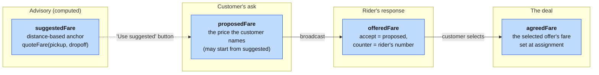
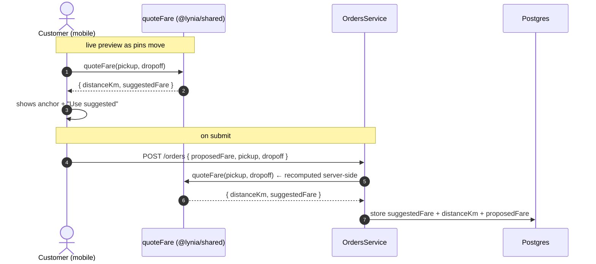
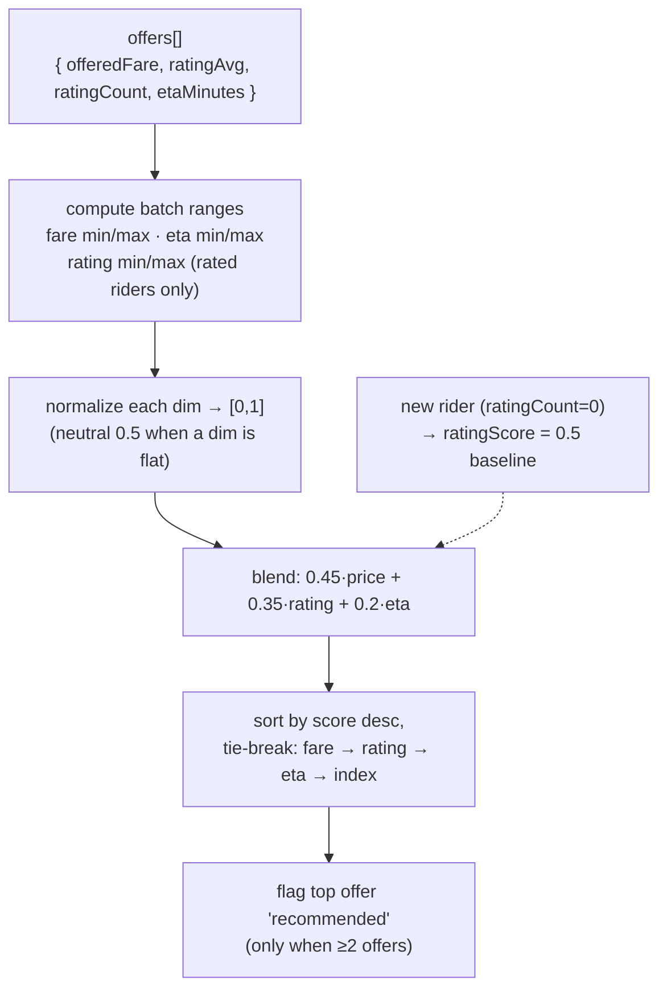

# Lynia — Pricing & offer ranking

Lynia is a **matchmaker, not a price-setter**: the customer names the price, riders accept or counter,
and the customer always chooses. Two pure, shared modules shape that negotiation without ever taking
control of it:

- **`suggestFare` / `quoteFare`** ([`packages/shared/src/pricing.ts`](../packages/shared/src/pricing.ts)) —
  the *anchor*: a fair starting price we show the customer.
- **`rankOffers`** ([`packages/shared/src/offer-ranking.ts`](../packages/shared/src/offer-ranking.ts)) —
  the *best-match sort*: how the returned offers are ordered so the customer isn't staring at an
  unsorted list.

Both live in `@lynia/shared` and are **pure and framework-free**, so the API and the mobile client run
the exact same math — the customer's live preview and the number stored on the order can never drift.
This doc is the reference for both; see [ARCHITECTURE §6](./ARCHITECTURE.md#6-the-offer-loop-core-sequence)
for how they sit inside the offer loop.

---

## 1. The fare vocabulary

Four distinct fares travel with an order. Keeping them separate is what lets the negotiation stay
honest — the anchor is advisory, the customer's number is the actual ask, and the agreed number is
what gets paid.



| Field | Where set | Meaning |
|---|---|---|
| `suggestedFare` | `OrdersService.create` via `quoteFare` | Distance-based anchor stored on the order; shown to the customer as guidance. Never binding. |
| `proposedFare` | Customer input at create (`CreateOrderRequest.proposedFare`) | The price the customer actually names and broadcasts. Can be the suggested value, or anything positive. |
| `offeredFare` | Rider at `POST /orders/:id/offers` | `accept` → equals the proposed fare; `counter` → the rider's own number. |
| `agreedFare` | Set by the guarded CAS at selection | Copied from the selected offer's `offeredFare` — the final price. |

The customer is never forced onto the anchor: the mobile create screen shows
`Suggested fare $X · N km` with a one-tap **"Use suggested"** button, but the "Your price" field is
free-form (`apps/mobile/app/home.tsx`).

---

## 2. The suggested-fare model

A deliberately simple, transparent **flag-fall + per-km** model. Simplicity is a feature here: the
customer can predict it, and it's trivial to retune from real corridor data at the pricing spike (T0).

### Formula

```
suggestedFare(distanceKm) = max( minUsd, baseUsd + perKmUsd × distanceKm )   // rounded to 2dp
```

### Pilot constants (`FARE`)

| Constant | Value | Role |
|---|---|---|
| `baseUsd` | `1.50` | Flag-fall — pickup + handling, independent of distance. |
| `perKmUsd` | `0.60` | Distance component. |
| `minUsd` | `1.50` | Hard floor — short hops still cost the rider time. |
| `earthRadiusKm` | `6371` | For the Haversine distance. |

> These are **USD pilot values for the Harare corridor** and are explicitly placeholders — tune them
> at the pricing T0 spike on real ride data. Because they're one `const` in one shared file, retuning
> is a single-line change that both clients pick up.

### Distance: great-circle (Haversine)

`quoteFare(pickup, dropoff)` computes straight-line **Haversine** distance between the two lat/lng
points — not routed road distance. That's intentional for the pilot (no routing dependency, no map
API cost on every keystroke); it under-estimates real road distance, which the rider's counter-offer
naturally corrects for. `haversineKm` returns `0` for any non-finite coordinate, so a half-entered
form previews the floor price rather than `NaN`.

### Worked examples

| Distance | `base + perKm × d` | After floor | Suggested |
|---|---|---|---|
| 0 km | 1.50 | max(1.50, 1.50) | **$1.50** |
| 1 km | 2.10 | max(1.50, 2.10) | **$2.10** |
| 3 km | 3.30 | — | **$3.30** |
| 5 km | 4.50 | — | **$4.50** |
| 10 km | 7.50 | — | **$7.50** |

### Where it runs



The server **recomputes** the anchor at create time rather than trusting a client-supplied number, so
the stored `suggestedFare`/`distanceKm` are always authoritative.

---

## 3. Offer ranking (best-match)

Once riders respond, the customer sees a list. Presenting it unsorted invites decision-paralysis and a
pure race-to-the-bottom on price. `rankOffers` orders offers by a **blended score of price + rating +
ETA** and flags the single best one `recommended` — so a cheap-but-slow-and-poorly-rated offer doesn't
automatically win, while the customer still picks whoever they want (design decision **D-d**).

### The blend

```
score = w.price × priceScore + w.rating × ratingScore + w.eta × etaScore     ∈ [0, 1]
```

Each dimension is **min–max normalized across the current batch** to `[0,1]`, with the "better"
direction flipped so higher is always better:

- `priceScore` — lower fare is better
- `etaScore` — lower ETA is better
- `ratingScore` — higher rating is better

### Default weights (`DEFAULT_OFFER_WEIGHTS`)

| Dimension | Weight | Rationale |
|---|---|---|
| `price` | **0.45** | The largest single factor — the customer named the price. |
| `rating` | **0.35** | Trust / quality. |
| `eta` | **0.20** | Speed to pickup. |

The tuning invariant: **`price` (0.45) must stay below `rating + eta` combined (0.55)**, so quality +
speed *together* can outweigh a rock-bottom price. If price ever exceeded the other two combined,
best-match would collapse into "cheapest" and defeat its own purpose.

### The ranking pipeline



### Edge cases the code handles deliberately

| Case | Behaviour | Why |
|---|---|---|
| **New rider** (`ratingCount = 0`) | Rating axis = neutral `0.5` (`NEW_RIDER_RATING_SCORE`), not `0` | A brand-new rider shouldn't be punished as if rated badly — but the baseline must **not exceed 0.5**, or an unproven rider would out-score a proven high-rated one. Fare/ETA differentiate them. |
| **Flat dimension** (all offers equal on a dim, e.g. everyone offered the same fare) | That dim scores `0.5` for all → doesn't sway the ranking | `norm` returns `0.5` when `max <= min`. A dimension nobody differs on shouldn't move the result. |
| **Only rated riders define the rating range** | Unrated riders are excluded from `ratingMin/Max` | So one rated rider doesn't collapse the range and distort the rated peers. |
| **Ties on score** | Deterministic tie-break: cheaper → better-rated → sooner → original order | Stable, explainable ordering; the raw-rating tie-break still favours the genuinely higher-rated rider. |
| **Single offer** | Not flagged `recommended` | A lone offer needs no marker. |

### Worked example

Three offers on one order (default weights):

| Offer | fare | rating (count) | eta |
|---|---|---|---|
| A | $3.00 | 4.8 (40) | 15 min |
| B | $2.50 | 4.0 (10) | 25 min |
| C | $2.80 | — (new) | 10 min |

Batch ranges: fare `[2.50, 3.00]`, eta `[10, 25]`, rating (rated only) `[4.0, 4.8]`.

| Offer | priceScore | ratingScore | etaScore | **blended** |
|---|---|---|---|---|
| A | 0.00 | 1.00 | 0.67 | **0.483** |
| B | 1.00 | 0.00 | 0.00 | **0.450** |
| C | 0.40 | 0.50 (new) | 1.00 | **0.555** ⭐ |

**Ranked: C → A → B.** The cheapest offer (B) lands *last*, and a new rider (C) with the fastest ETA
and a mid-range price is recommended — exactly the "don't collapse into cheapest" behaviour the blend
is designed for.

### Client sort modes

The mobile order screen (`apps/mobile/app/order/[id].tsx`) exposes `rankOffers` as the **"best"** sort
mode; **cheapest / fastest / rating** are plain single-key sorts. Selection itself is unaffected by any
sort — the customer still chooses. Ranking is presentation only; the server never auto-assigns.

---

## 4. Tuning checklist (T0 pricing spike)

Everything tunable is a named constant in one of two shared files — no logic changes needed to retune:

- **Fare curve** — `FARE.baseUsd`, `FARE.perKmUsd`, `FARE.minUsd` in `pricing.ts`.
- **Ranking weights** — `DEFAULT_OFFER_WEIGHTS` in `offer-ranking.ts` (keep `price < rating + eta`).
- **New-rider baseline** — `NEW_RIDER_RATING_SCORE` (keep `≤ 0.5`).
- **Distance model** — swap Haversine for routed distance in `quoteFare` if/when a routing provider is
  added; the four fares and the ranking are unaffected.

Both modules are unit-tested from the API package (`*.spec.ts`), so a retune is a value change plus a
green test run.
</content>
