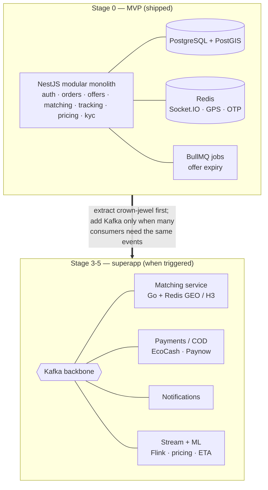

# Lynia — Reference Architectures (inDrive · Gojek · Grab · Chowdeck)

> **Why this doc.** A teardown of how the on-demand marketplaces Lynia is modelled on actually run their
> systems, mapped against **what Lynia already ships today**, plus the scale-up ladder for the superapp
> phase. The headline: Lynia's MVP architecture is **not a guess — it is the reference pattern**, built in
> the stack best suited to a small, AI-assisted ("vibecoded") team. Nothing here changes the MVP; it
> records *why* the choices are right and *what changes when we grow*.
>
> Companion to `docs/CONCEPT.md` (§5 tech architecture) and `docs/ENG-REVIEW.md` (E1–E4, ET1–ET10).
> Status: reference / validation — no build work implied.

---

## 1. What the reference companies actually run

| Company | Core language | Eventing / realtime | System of record | Geo / matching | Cloud | Notable |
|---|---|---|---|---|---|---|
| **Gojek** (ride · food · pay superapp) | **Go** (some Java, Clojure) | **Kafka** backbone, gRPC+Protobuf | PostgreSQL, Elasticsearch, Redis | Custom geo-indexing, Redis | **GCP** | 1000+ microservices on Kubernetes; open-sourced much tooling |
| **Grab** (ride · food · fintech) | **Go** | **Kafka + Flink** stream processing | MySQL/Aurora, DynamoDB, Redis | **Hexagonal grid (H3-like)** + Redis GEO | **AWS** | In-house ML platform (Catwalk); one of SEA's largest AWS users |
| **inDrive** (price-negotiated ride) | **Go** | **Kafka + RabbitMQ**, event-driven | PostgreSQL, Redis | Geo radius matching | — | **Customer-priced bidding** (not auto-match); Prometheus/Grafana/ELK observability |
| **Chowdeck** (NG food/grocery delivery) | **Node.js** | Redis (queues/cache) | **MySQL**, Redis | Geo radius + live rider tracking | **AWS** (+ some GCP) | CTO ex-**Paystack** → fintech-grade reliability; **leaner** than the SEA giants. Local rails: **Paystack / Flutterwave** |

**Sources:** [inDrive Go backend role](https://jobs.generalcatalyst.com/companies/indrive/jobs/41643113-backend-engineer-go) ·
[Chowdeck (YC)](https://www.ycombinator.com/companies/chowdeck) ·
[Chowdeck overview](https://startuplist.africa/startup/chowdeck) ·
[companies using Go](https://www.netguru.com/blog/companies-that-use-golang).
Gojek/Grab stacks are from their public engineering blogs (Go + Kafka + Kubernetes; Grab's H3-style hex grid).

### The pattern they all share

1. **Event-driven core** — work is decoupled through a message bus (Kafka at the giants, Redis at Chowdeck).
   "Order placed → matched → assigned → delivered" are *events*, not one long synchronous call.
2. **A relational system-of-record** for orders / users / money — Postgres or MySQL, never a NoSQL doc store
   for the things that must be consistent.
3. **Redis everywhere** — live driver location, geo radius queries, caching, rate-limiting, pub/sub fan-out.
4. **A purpose-built matching engine** as the crown jewel — inDrive's price-bidding loop is the closest
   sibling to Lynia's, and the part everyone invests most in.
5. **Pick the language for the team, not the brochure.** Three giants chose Go for raw throughput at hundreds
   of cities. **Chowdeck chose Node.js** and is winning the *same on-demand-delivery problem in Africa* — proof
   that for a focused, fast-moving team the runtime is a productivity decision, not a correctness one.

---

## 2. How Lynia already embodies it (shipped MVP)

Lynia's built architecture (`apps/api` NestJS modules, `docs/CONCEPT.md §5`, `docs/ENG-REVIEW.md`) maps the
reference pattern point-for-point:

| Reference pattern | Lynia today | Where in the repo |
|---|---|---|
| Customer-priced bidding (inDrive) | **Offer loop**: broadcast → accept/counter (one round) → customer selects | `apps/api/src/{orders,offers,matching}` |
| Event-driven / async work | **BullMQ** jobs (offer-window expiry) + **Socket.IO over Redis** broadcast fan-out | `apps/api/src/tracking`, ENG-REVIEW ET1/ET4 |
| Relational system-of-record | **PostgreSQL** via Prisma; guarded **compare-and-swap** on `orders.status` | `apps/api/prisma`, ENG-REVIEW ET1 |
| Redis for live location + fan-out | **Redis** = Socket.IO adapter, last-GPS cache, OTP attempt counters | ENG-REVIEW ET4/ET5 |
| Geo radius matching | **PostGIS** `geography(Point)` + **GiST** index + `ST_DWithin` | ENG-REVIEW ET6 |
| Concurrency-safe assignment | `one_active_ride` partial unique index; select/expiry = one CAS; in-TX liveness | ENG-REVIEW ET1–ET3 |
| Observability (inDrive: Prom/Grafana/ELK) | **OpenTelemetry** instrumentation | `apps/api/src/observability` |
| One language, shared types | **TypeScript** across Expo app + NestJS API + Next.js admin + zod contracts | `packages/shared`, monorepo (ET10) |

**Conclusion: there is no MVP architecture to redesign.** Lynia is the inDrive model, built on the same
relational + Redis + event-driven foundation the references use, in the runtime (TypeScript/Node) that
Chowdeck has already validated for this market and that an AI-assisted team is most productive in.

### Language recommendation (the "what should we use, vibecoding it" question)

**Stay on TypeScript / Node (NestJS). Do not rewrite to Go.** Rationale:

- **Vibecoding leverage** — one language end to end (mobile, API, admin, shared zod types) means the most
  context per file, the strongest LLM training coverage, and no FFI/serialization seams to babysit. This is
  the single biggest velocity multiplier for a small AI-assisted team.
- **Proven in-market** — Chowdeck runs the *same* African on-demand-delivery problem on Node.js at real scale.
- **The throughput argument doesn't bite yet** — Go's edge is hundreds of cities of matching load. Lynia is
  one Harare corridor. The hot path is already isolated (raw SQL + PostGIS + Redis, not ORM-in-a-loop), so
  *if* a single matching service ever needs Go-grade throughput, it can be extracted behind its existing
  module boundary **without touching the rest of the system**. Optimize when measured, not preemptively.

---

## 3. The scale-up ladder (Express → superapp)

This is where the Gojek/Grab playbook actually starts to apply. Each rung is **additive** and triggered by a
real signal — never built ahead of need (CONCEPT §5b "design the seams, don't build the rooms").

| Stage | Trigger | What changes | Borrowed from |
|---|---|---|---|
| **0 — MVP (today)** | one corridor | Modular monolith: NestJS + Postgres/PostGIS + Redis + BullMQ + Socket.IO | inDrive (bidding), Chowdeck (Node, lean) |
| **1 — Multi-corridor / multi-city** | 2nd+ city, growing rider fleet | Promote hottest geo queries to **Redis GEO**; read replicas; partition broadcasts per city/zone | Grab (Redis GEO) |
| **2 — Commerce verticals (COD)** | pharmacy → grocery → food | Activate stubbed `merchant` order type + `merchants` table; **add EcoCash/Paynow** (ZW rails — *not* Paystack) for COD settlement | Chowdeck (merchant + payment rails) |
| **3 — Event backbone** | many services need the same events | Introduce **Kafka** as the spine; orders/offers/tracking emit to topics; consumers (notifications, analytics, ML) subscribe. BullMQ stays for jobs | Gojek/Grab/inDrive (Kafka) |
| **4 — Service extraction** | a module becomes a scaling or team bottleneck | Carve **matching/dispatch** out of the monolith first (optionally in **Go**); H3-style hex grid if Redis GEO is maxed | Grab (H3 grid), Gojek (Go services) |
| **5 — Stream processing / ML** | surge pricing, demand prediction, fraud | **Flink/stream** jobs over Kafka; feature store; ML-scored pricing & ETA | Grab (Flink + Catwalk) |

---

## 4. The one geography correction

Chowdeck is the closest *operational* sibling (African, on-demand delivery, Node.js, fintech-grade ops) — but
it is **Nigerian**. Its payment rails are **Paystack / Flutterwave**. Lynia is **Zimbabwean** and cash-first,
so when settlement eventually arrives (Stage 2, ~6–8 months out per CONCEPT §6) the rails are **EcoCash /
Paynow**, not Paystack. Copy Chowdeck's *reliability culture and lean shape*, not its specific payment vendor.

---

## 5. Takeaways

- **MVP:** nothing to change. Lynia already *is* the inDrive/Chowdeck reference architecture, in the right
  language for a vibecoding team. Ship the pilot.
- **Language:** TypeScript/Node stays. Go is a *targeted, later* extraction for the matching service only, if
  and when load demands it — behind the boundary that already exists.
- **Growth:** follow the ladder in §3. Kafka, Redis GEO/H3, and service extraction are **Stage 3-4 tools**,
  pulled in on real signals — the Gojek/Grab end state, reached one validated rung at a time.
</content>
</invoke>
