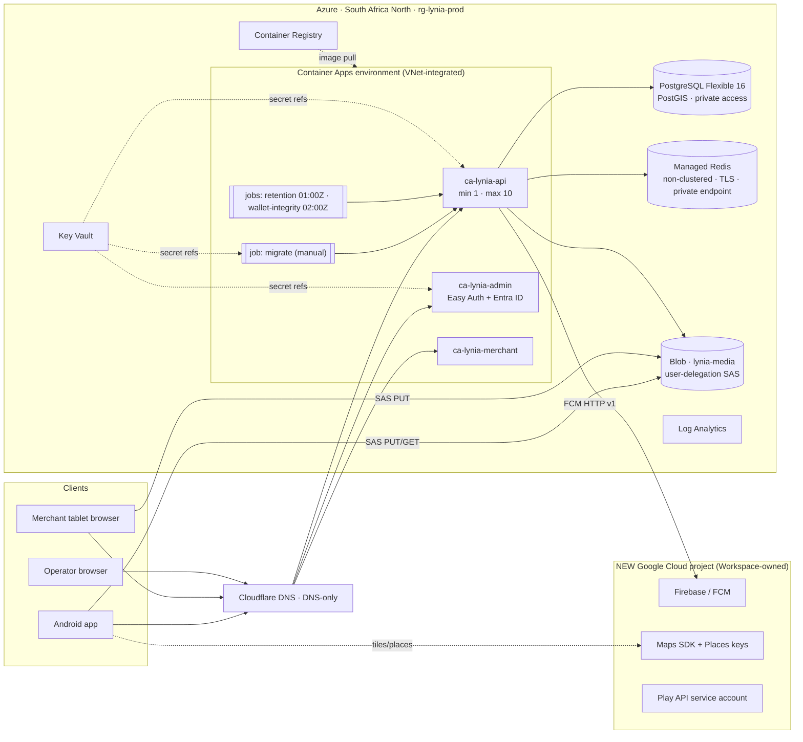

<!-- /autoplan restore point: "/root/.gstack/projects/unnfazzed-Lynia/claude-trusting-euler-z6yz4d-autoplan-restore-20260924-145327.md" -->
## Implementation plan
# GCP → Azure migration plan

**Status:** PROPOSED 2026-09-24. **Nothing in this plan has been executed.** Owner decisions in §12 gate
Phase 1 onward. Do not treat any section as approved until the owner signs off in this file's review log
(§14).

**Scope:** everything that ran in GCP project `lynia-500911` (project number `407250490173`), plus the
Google-platform services the Android app depends on.

**Method:** every coupling below was verified in **code, workflow YAML, Terraform or live CI run logs**, not
from docs. The owner asked for exactly that. Docs are cited only where no code can show a fact, and those
citations are marked **DOC**. Live evidence is marked **[RUN]** with the Actions run id.

---

## 0. Executive summary

**What happened.** The project was cut off in two steps:

| When (UTC) | What Google returned | Evidence |
|---|---|---|
| 2026-09-16 22:40 | `This API method requires billing to be enabled. Please enable billing on project #407250490173` | [RUN] deploy-staging 35158440185 |
| 2026-09-17 → today | `Permission denied: Consumer 'projects/407250490173' has been suspended.` | [RUN] gcp-drift-detect 35981995171 (and every night since 09-17) |

The last healthy check was 2026-09-16 09:32 UTC. The last green production release was 2026-09-01
([RUN] 33552453475). **The backend has now been down for about 7 days.** Billing failed first and the
suspension came after, which points to a **billing-account problem rather than a policy strike**. §1 explains
why that matters for recovering the data.

**What is broken, for whom:**

| Surface | State | Why |
|---|---|---|
| Android app (0.49.0, versionCode 36, on the "Closed testing" track) | Cannot sign in, order or track | API host `lyniago.lyniafinance.com` points at a dead GCP load balancer |
| Push notifications | Dead | The Firebase/FCM project **is** `lynia-500911` |
| Native map (Android) | Blank | [RUN] maps-key-doctor 36014734161: *"Google has disabled the use of APIs from this API project."* |
| Address search | Degraded | The Places key is in the same project. The app falls back to the device geocoder (`apps/mobile/src/logic/geocode.ts`) |
| Admin console and merchant dashboard | Down | Cloud Run + IAP in the suspended project |
| Play submissions via EAS | Will fail | The submitter is `id-play-publisher@lynia-500911` (**DOC** `PLAY-STORE-SUBMISSION.md:34-35`). Manual AAB upload in Play Console still works |
| Play listing compliance | At risk | The privacy-policy and account-deletion URLs are served by the dead API (**DOC** `PLAY-STORE-SUBMISSION.md:1391,1401`) |
| CI | Red | 9 of 21 workflows are fully GCP-bound. `gcp-drift-detect` fails nightly |

**The plan in seven lines:**

1. **Salvage, time-boxed.** Try to get the data and two secrets back out of GCP (§9). If that fails, start fresh.
   The closed test has no real money in it; §9 shows why.
2. **Rehost the backend on Azure, South Africa North (Johannesburg).** Same metro as `africa-south1`, so
   latency and data residency are unchanged. Services: Container Apps, PostgreSQL Flexible Server (PostGIS),
   Azure Managed Redis (non-clustered), Blob Storage, Key Vault and ACR. Infra is Terraform, CI uses GitHub
   OIDC with no stored keys.
3. **Re-home the Google-platform dependencies in a new, clean Google Cloud project.** That means Firebase/FCM,
   the Maps SDK and Places keys, and the Play API service account. Azure cannot replace these (§3.2).
4. **Keep the hostname `lyniago.lyniafinance.com`.** The installed build is **unpinned** and has **no URL
   override**, verified from EAS ([RUN] eas-build-status 36014729687). So the moment DNS points at Azure,
   testers' existing app can sign in, order, track and upload again, **with no new binary**.
5. **Ship one new binary** on the closed track to bring push and the map back. Force-update the old build.
6. **Apply for Play production access** only after steps 4 and 5 are live.
7. **Harden.** Off-cloud backups, two owners on every account, budgets, and edge WAF at launch prep. That way
   one account suspension can never take everything down again.

**Critical path.** It runs through the Azure account, Terraform, five small code changes, CI, staging checks
and the DNS cutover: about **5–8 working days** for a solo founder with Claude sessions. The mobile rebuild
runs in parallel and is not on the critical path.

**Cost.** Estimated at **~$70–125/month for prod, plus ~$25–45/month for staging when it's running**. The
last real GCP bill was **$189.68/month** (SKU export 2026-08-17..09-15, from the #921 commit message). See §11.

---

## 1. Evidence, and what "suspended" means for recovery

- `Consumer 'projects/407250490173' has been suspended` is Google's API-consumer suspension. **Every** API
  billed to or owned by the project refuses calls. That includes serving (Cloud Run, SQL, Redis, GCS),
  Secret Manager, Firebase/FCM (both sending from the server and registering on devices), the Maps keys,
  and the Play Developer API when called through a service account from this project.
- The same log line binds `projects/407250490173` to `lynia-deployer@lynia-500911.iam.gserviceaccount.com`,
  which confirms the project number maps to `lynia-500911`.
- **Billing failed first.** A billing-account problem (failed payment, closed or suspended billing account,
  or the billing-admin change attempted in `docs/GCP-BILLING-DOMAIN-SETUP.md` / #911) usually clears when the
  billing account is fixed. A policy suspension needs an appeal. **The Google Cloud email sent to the owner
  says which it is and whether a deletion date applies.** A project suspension notice comes from
  `google-cloud-compliance@google.com`; billing notices come from Google Payments. We could not read the inbox:
  the Gmail connector needs re-authorizing (§12 Q1).
- **The deletion deadline is unknown, and nothing documents a 30-day clock.** Google's project-suspension
  guidelines say a project suspended for **more than nine months** is marked for deletion, then fully deleted
  about 30 days later. For an **invalid billing account** they say only that "some resources might be removed"
  after "a protracted period", and "Removed resources are not recoverable". So treat the data as at risk *now*.
  This is the one deadline in the plan that we don't control. (Corrected by CEO-2.)

## 2. Where we are going: target architecture



| Resource | Proposed name / SKU (pilot) | Replaces |
|---|---|---|
| Resource groups | `rg-lynia-prod-san`, `rg-lynia-staging-san`, `rg-lynia-tfstate` | project `lynia-500911` |
| Container Apps env | `cae-lynia-prod`, workload-profiles env, Consumption profile, VNet subnet /23 | Cloud Run + serverless VPC connector |
| API | `ca-lynia-api`, 0.5 vCPU / 1 GiB, **minReplicas 1**, max 10, multiple-revision mode | Cloud Run `lynia-api` |
| Admin | `ca-lynia-admin`, 0.25 vCPU / 0.5 GiB, min 0, Easy Auth (Entra) | Cloud Run `lynia-admin` + IAP |
| Merchant | `ca-lynia-merchant`, 0.25 vCPU / 0.5 GiB, min 0 | Cloud Run `lynia-merchant` |
| Jobs | `caj-lynia-migrate` (manual), `caj-lynia-retention`, `caj-lynia-wallet-integrity` (scheduled) | Cloud Run job + Cloud Scheduler |
| Postgres | Flexible Server **v16**, Burstable **B1ms**, 32 GiB, PITR 7 days, `azure.extensions=POSTGIS`, private access | Cloud SQL `lynia-pg` (PG16) |
| Redis | Azure Managed Redis **Balanced B0**, **Non-clustered** policy, HA off (pilot), access-key auth on, private endpoint | Memorystore `lynia-redis` (7.2 BASIC) |
| Storage | StorageV2, LRS, container `lynia-media` private, versioning + 14-day soft delete, shared-key auth **disabled** | GCS `lynia-media` |
| Secrets | Key Vault, RBAC mode, purge protection on | Secret Manager |
| Registry | ACR Basic, admin user disabled, managed-identity pull | Artifact Registry `lynia` |
| Logs | Log Analytics, daily ingestion cap | Cloud Logging |
| CI identity | User-assigned identity `id-lynia-deploy` + GitHub federated credentials | WIF pool + `lynia-deployer` |

**Region note.** Everything stays in South Africa, so the cross-border posture in the privacy notice is
unchanged: Zimbabwe → South Africa. Only the provider name changes (§5, C6). Check at provisioning time that
every SKU is offered in South Africa North. Azure Managed Redis is the one to check:
`az redisenterprise list-skus-for-scaling` or the portal. If it isn't offered, the fallback is §13 R2.

## 3. Verified coupling inventory (the whole blast radius)

### 3.1 Backend hosting: Azure replaces these

| # | GCP resource, with code evidence | Azure replacement | Change type |
|---|---|---|---|
| H1 | Cloud Run `lynia-api`: port 3000, `--timeout 3600`, `--max-instances 10`, LB-only ingress (`.github/workflows/release.yml:719-735`). No min-instances or CPU-always setting in code, so the 7 in-process sweeps and BullMQ workers only ran while requests were in flight | Container Apps `ca-lynia-api`, **minReplicas 1** | workflow + IaC |
| H2 | Migrations: Cloud SQL Auth Proxy from the runner (`release.yml:377-394`, the live path), or a Cloud Run job (`release.yml:403-423`) | Container Apps **manual job** in the VNet, same image, `prisma migrate deploy` | workflow |
| H3 | Cloud SQL PG16 `db-custom-1-3840`, PITR on, public IP for the proxy (`infra/terraform/sql.tf:6-52`). PostGIS is the only extension (`prisma/migrations/0001_init/migration.sql:5`) | PG Flexible v16, `azure.extensions=POSTGIS`, private access. Do not change the PG major version during the cloud move | `DATABASE_URL` format only |
| H4 | Memorystore Redis 7.2, AUTH on, no TLS (`infra/terraform/redis.tf:4-21`). Used for BullMQ, the Socket.IO adapter, OTP counters, the throttle, the geo index and micro-cache L2 | Azure Managed Redis, **Non-clustered** (Lua at `tracking/tracking.service.ts:639` writes keys it doesn't declare; BullMQ keys have no hash tags), TLS port 10000 | **code** (C2) + `rediss://` URL |
| H5 | GCS V4 signed URLs that bind content-type and `x-goog-content-length-range` (`adapters/storage/gcs.storage.ts:40-58`). The header is returned to clients (`uploads/uploads.controller.ts:117-130`) | Blob + **user-delegation SAS** via managed identity. SAS binds **neither** content-type **nor** size, so the checks move server-side | **code** (C1) |
| H6 | Secret Manager, injected with `--set-secrets` (`release.yml:565-673`) | Key Vault + Container Apps `keyvaultref:` secrets → env. **Key Vault names can't contain `_`**, so `DATABASE-URL` in the vault maps to `DATABASE_URL` in env | none in app (`EnvSecrets`) |
| H7 | Artifact Registry (`artifact-registry.tf`) | ACR Basic | workflow |
| H8 | WIF `github-pool` + deployer/provisioner SAs (`wif.tf`, `iam.tf:62-113`, `provisioner.tf`) | UAMIs with federated credentials: `repo:unnfazzed/Lynia:environment:{production,staging,infra}` (case-sensitive, §6) | workflow + IaC |
| H9 | Global HTTPS LB, serverless NEGs, Google-managed certs, one anycast IP (`lb.tf`, `admin.tf`, `merchant.tf`, `staging.tf`) | Container Apps ingress + custom domains + **free managed certificates** | DNS records |
| H10 | Cloud Armor: the per-IP throttle (3000/60s) is always on; **the OWASP rules are gated OFF** (`armor.tf`, `variables.tf:146-163`) | Pilot: none at the edge; the app's `@Throttle` (Redis-backed) stays. Launch prep: Cloudflare proxy rate-limit or Front Door WAF (D7) | IaC later |
| H11 | IAP on admin (`admin.tf:89-116`). The app verifies `x-goog-iap-jwt-assertion` (`apps/admin/middleware.ts:51-56`, `app/lib/iap-jwt.ts:25-27`). Sign-out is `/?gcp-iap-mode=CLEAR_LOGIN_COOKIE` (`app/components/Sidebar.tsx:111`). The app admits **any** authenticated operator (`app/lib/console-auth.ts:93-107`); IAP's allowlist was the only authorization | Easy Auth + Entra ID, **assignment required**, proxy-header mode, plus an app-level allowlist | **small code** (C4) |
| H12 | Cloud Scheduler ×3 with Google OIDC (`scheduler.tf`) → `AdminOrSchedulerGuard` verifies Google ID tokens (`auth/admin-or-scheduler.guard.ts:71-89`). The settlement auto-pause job targets `/admin/cash/settlements/auto-pause`, which **has no route**, so it is stale and not ported | Container Apps **scheduled jobs** (cron in UTC; Harare = UTC+2 with no DST, so 03:00 → `0 1 * * *` and 04:00 → `0 2 * * *`) → Entra managed-identity token → the same endpoints | **code** (C3) |
| H13 | VPC, PSA peering, serverless connector (`network.tf`) | VNet 10.20.0.0/16: `snet-aca` /23 (delegated `Microsoft.App/environments`), `snet-pg` /28 (delegated to Flexible Server), `snet-pe` /28 | IaC |
| H14 | OTel sidecar → Cloud Trace/GMP (`infra/otel-collector/config.yaml`), **off unless** `OTEL_SIDECAR_ENABLED` (`release.yml:687-717`) | No sidecar. The app already speaks vendor-neutral OTLP/HTTP (`observability/otel.ts:26-75`) and the SDK honours `OTEL_EXPORTER_OTLP_HEADERS`, so it points straight at an OTLP backend (D13) | env only |
| H15 | Cloud Monitoring uptime check (always on) + PromQL alert policies (gated off) (`monitoring.tf`) | External uptime monitor + Azure Monitor metric alerts; PromQL alerts come back when OTel is armed | IaC |
| H16 | KMS CMEK for the bucket (off) | Microsoft-managed keys | none |
| H17 | Terraform state in `gs://lynia-tfstate` (`versions.tf:30-33`). **It also holds the generated JWT/PII secrets in plaintext** | New `infra/azure/` module; azurerm backend in `rg-lynia-tfstate` | new module |
| H18 | Canary 5xx gate reads `run.googleapis.com/request_count` (`release.yml:811-835`) | Revision weights + **revision labels** (a direct URL to the candidate, which GCP never had because `*.run.app` was disabled) + the `Requests` metric by revision and status class | workflow |

### 3.2 Google-platform dependencies: Azure does **not** replace these

| # | Dependency | Evidence | Why Azure doesn't solve it | Replacement |
|---|---|---|---|---|
| G1 | Firebase/FCM push | `infra/terraform/project.tf:37-38`, `iam.tf:37-41`. Server sends via ADC (`adapters/push/fcm.push.ts:77-82`). The device uses a native FCM token (`apps/mobile/src/push/push.ts:86`) | Android push on Play devices *is* FCM. Azure Notification Hubs itself needs FCM v1 credentials | A **new Firebase project**. The server credential is a service-account JSON from Key Vault, mounted as a file with `GOOGLE_APPLICATION_CREDENTIALS` pointing at it; `applicationDefault()` then works unchanged. The new `google-services.json` means **a new binary** |
| G2 | Maps SDK for Android key | `apps/mobile/app.config.ts:10,356`. No `provider` prop on any `MapView`, so Android uses the Google Maps SDK | react-native-maps on Android is Google Maps. Leaving it means a MapLibre rewrite of 5 map screens, plus pixel-parity rework under CLAUDE.md | A new key in the new project, restricted to `zw.co.lynia` + **both** SHA-1s (Play app-signing *and* the EAS upload key; the MOB-MAP-02 lesson). It's native, so **a new binary** |
| G3 | Places web-service key | `apps/mobile/src/api/places.ts:19-20`; JS-inlined | It could move to Azure Maps Search (JS-only), but quality in Harare is untested | A new key: API-target-restricted, quota-capped, **EAS visibility `sensitive`**. It rides the new binary |
| G4 | Play Developer API service account `id-play-publisher@lynia-500911` | **DOC** `PLAY-STORE-SUBMISSION.md:34-35,166-167`. Key held in EAS credentials (`mobile-release.yml:11-12`) | It is a Google identity by definition | A new SA in the new project → Play Console → Users and permissions → invite → JSON key into EAS credentials. Fallback: manual AAB upload |

### 3.3 Not affected

- Play listing, the app-signing key (held by Play) and the upload keystore (EAS).
- `versionCode`: EAS remote (`apps/mobile/eas.json:4`).
- EAS Build and Update (`u.expo.dev`), GitHub, and the Cloudflare zone.
- Sentry, PostHog, Didit, Bird, WhatsApp.
- Vendor webhooks, because the hostname is unchanged. Every webhook verifies the raw body (`main.ts:63`), so nothing in front may rewrite bodies.

## 4. Decisions (recommendation first; the rejected alternatives are listed so the review can challenge them)

| # | Decision | Recommendation | Rejected, and why |
|---|---|---|---|
| D1 | Compute | **Azure Container Apps.** It is the closest Cloud Run analog: revisions and traffic weights keep the existing canary design, admin and merchant can scale to zero, jobs cover migrate and cron, managed certs, Easy Auth and Key Vault references are built in | App Service: no jobs, slot-based canary, 230 s front-end timeout. AKS: too much to operate for a solo founder |
| D2 | Region | **South Africa North** (same metro as africa-south1) | Europe: +150 ms to Harare, and it changes the residency statement |
| D3 | Redis | **Managed Redis Balanced B0, Non-clustered**, TLS, access keys on (AMR defaults to Entra-only), private endpoint | OSS/Enterprise clustering: CROSSSLOT on the Lua and BullMQ scripts. Self-hosted Redis in a container: no persistence or SLA |
| D4 | Postgres | **Flexible v16 B1ms**, private access, migrations through an in-VNet job (the repo's own `DB_PRIVATE_ONLY` target, SECURITY.md P2-1). Set **`connection_limit` in `DATABASE_URL`** (honoured at `prisma/prisma.service.ts:30-33`): B1ms allows about 50 connections, and 10 replicas × the default pool of 10 = 100 | Public access plus a runner firewall rule: it widens the attack surface and GitHub runner IPs are dynamic. A PG17 upgrade: never combine it with a cloud move |
| D5 | Object storage | **Blob + user-delegation SAS** (no account keys anywhere). `Storage Blob Data Contributor` on the container + `Storage Blob Delegator` on the account. CORS for the merchant origin | Account-key SAS: a long-lived key in env |
| D6 | Secrets | **Key Vault + Container Apps Key Vault references** (versionless) | Env vars in the workflow: secrets would sit in GitHub |
| D7 | Edge / WAF | **Cutover:** Container Apps ingress + managed cert, **Cloudflare DNS-only**. That keeps the `TRUST_PROXY=1` hop count, and matches today, since the OWASP rules were off. **Launch prep:** Cloudflare proxied + a rate-limit rule (cheapest; then set `TRUST_PROXY=2` or key on `CF-Connecting-IP`), **or** Front Door Standard + WAF custom rules (~$35/mo+) | Front Door Premium for managed OWASP rules: ~$330/mo, oversized for the pilot |
| D8 | Scheduler | **Container Apps scheduled jobs → curl with an Entra managed-identity token → the existing endpoints.** The guard gains an Entra verifier | BullMQ repeatable jobs: no execution history, and the schedules vanish on a Redis flush. GitHub cron: unreliable, and it would need a prod admin token in GitHub |
| D9 | Admin auth | **Easy Auth + an Entra ID app with "Assignment required = Yes"**, only named operators assigned; `ADMIN_CONSOLE_PROXY_HEADER=x-ms-client-principal-name`; an app-level allowlist as defence in depth; sign-out → `/.auth/logout` | Easy Auth with Google as the IdP: works, but needs an OAuth client in the new Google project and a mandatory allowlist |
| D10 | Google platform | **A new Google Cloud project, owned by a Google identity for `lyniafinance.com`, via Cloud Identity Free** (CEO-8). Mail already runs on Spacemail (MX `mx1/mx2.spacemail.com`), so **do not switch MX**. The runbook is `docs/GCP-BILLING-DOMAIN-SETUP.md`, but its "no mailbox exists" premise is wrong. The project gets **2 owners** and its own billing account (Maps needs billing; FCM doesn't) | Reusing the suspended consumer Gmail. Workspace with Gmail: it would take over MX and break Spacemail. Azure Maps: deferred (see G2) |
| D11 | IaC | **Terraform azurerm (+ azapi where azurerm lacks coverage)** in a new `infra/azure/`. Same ownership split as today: Terraform owns infra and app shells with `ignore_changes` on template, image and traffic; CI owns revisions. **Keep `infra/terraform/`** because API specs read it (`src/infra/lb-log-sampling.spec.ts:36-37`, `src/infra/maps-tfvars.spec.ts:21`) | Bicep: a second IaC language in the repo |
| D12 | Registry | **ACR Basic** (~$5/mo) with managed-identity pull | GHCR: Container Apps needs a long-lived PAT to pull private images |
| D13 | Observability | Logs to Log Analytics with a cap; an **external uptime monitor** (outside Azure, so it still alerts if Azure itself goes away); Azure Monitor metric alerts; Sentry unchanged. When armed, OTLP goes to Grafana Cloud or App Insights | The Container Apps managed OTel agent: gRPC only, and it can't send metrics to App Insights, while the app exports OTLP/**HTTP** |
| D14 | Backups | **A nightly encrypted `pg_dump` plus a media sync to a second provider** (e.g. Cloudflare R2, `age`-encrypted). This incident is "every copy, PITR included, was inside one suspended account" | Relying on Azure PITR alone repeats the single point of failure |
| D15 | API scaling | HTTP scale rule with **`concurrentRequests` ≈ 100–200**, not the default 10: each open Socket.IO connection is a long-lived request. Tune it from `apps/api/load` k6 runs | Defaults: 11 connected riders would scale out to 2 replicas, 100 would hit max 10 |

## 5. Code changes (one PR, "azure-portability"; tests for each)

- **C1 — Storage adapter.**
  - `adapters/storage/storage.interface.ts`: make `CloudProvider` `"gcp" | "azure"`. Add `headers` to `UploadTarget`, so the adapter owns provider headers. Add `stat(key)`.
  - New `adapters/storage/azure-blob.storage.ts`, using `@azure/storage-blob` + `@azure/identity`:
    - cache the user-delegation key and refresh it before expiry;
    - upload SAS gets `cw` permissions; read SAS gets `r`;
    - `startsOn` = now − 5 min to allow for clock skew;
    - `https` only;
    - return headers `{Content-Type, x-ms-blob-type: BlockBlob}`.
  - `storage.module.ts`: select the adapter on `env.CLOUD_PROVIDER`. It doesn't read that variable today, despite the comment at `app.module.ts:49`.
  - `uploads/uploads.controller.ts:117-130`: take the headers from the adapter. The GCS adapter returns its own `X-Goog-*` header, so GCP behaviour is unchanged.
  - **Close the SAS regression.** On every attach path, call `stat()` and reject (and delete) anything that is oversize or not `image/jpeg`/`image/png`. The attach points:
    - rider KYC (`riders/rider.service.ts:~197`);
    - pickup and delivery proof (`orders/order-lifecycle.service.ts`);
    - merchant logo, banner and dishes (`merchant/merchant.service.ts:~158`);
    - profile photo.
  - Add a nightly sweep for orphaned blobs, which bounds abuse of unattached uploads.
  - Clients need **no change**: mobile (`apps/mobile/src/api/uploads.ts:33-52`) and merchant (`apps/merchant/app/lib/menu-api.ts:127`) send back whatever headers the API returns.
  - `config/env.ts:81-85`: `CLOUD_PROVIDER: z.enum(["gcp","azure"])`, plus `AZURE_STORAGE_ACCOUNT`, `AZURE_STORAGE_CONTAINER` and `AZURE_CLIENT_ID`, with a boot-guard.
- **C2 — BullMQ TLS (a blocker; it would silently break the offer loop).**
  - `connectionFromUrl` exists twice, at `matching/offer-expiry.service.ts:42-51` and `orders/order-lifecycle.constants.ts:66-75`. Both drop the `rediss:` scheme.
  - Add `tls` (with `REDIS_CA_CERT` when set) and dedupe both into `common/redis.ts`.
  - Without this, offer expiry and rating auto-close cannot connect to TLS-only Azure Redis.
- **C3 — Scheduler auth.**
  - `auth/admin-or-scheduler.guard.ts`: add an `azure` verifier selected by `SCHEDULER_AUTH`, using `jose` + Entra JWKS.
  - Check four claims:
    - `iss` is `https://sts.windows.net/<tenant>/` or `https://login.microsoftonline.com/<tenant>/v2.0`;
    - `tid` is the tenant;
    - `aud` is `SCHEDULER_AUDIENCE`, the app-ID URI of a dedicated app registration;
    - `oid` is `SCHEDULER_PRINCIPAL_ID`, the cron job's identity.
  - The Google path stays for GCP.
  - Known trade-off: Entra's `aud` identifies the app, not the URL, so a token for one cron route is valid on the other. Both are idempotent admin sweeps. If that matters later, add an app role per job.
- **C4 — Admin console.**
  - `app/lib/console-auth.ts`: an optional `ADMIN_CONSOLE_ALLOWED_OPERATORS` allowlist that fails closed.
  - `Sidebar.tsx:107-111`: the sign-out URL comes from env, set to `/.auth/logout` on Azure.
  - Add a public `app/api/healthz` route; admin has none today.
  - Container env: `HOSTNAME=0.0.0.0`. Kubernetes-based hosts set `HOSTNAME` to the replica name, and Next.js standalone binds to it.
  - On staging, **verify that Easy Auth overwrites a forged `X-MS-CLIENT-PRINCIPAL-NAME`** (gate G-ADM).
- **C5 — Push.**
  - No code is needed for sending: `applicationDefault()` reads `GOOGLE_APPLICATION_CREDENTIALS`.
  - Turn the boot warning (`adapters/push/push.module.ts:12-17`) into a hard boot-guard off GCP, requiring both `FCM_PROJECT_ID` and the credentials file.
  - One-time cleanup: old-project device tokens aren't pruned, because `fcm.push.ts:8-11` only prunes `registration-token-not-registered` and `invalid-registration-token`. Delete `device_tokens` rows older than the new binary's release, once it is out.
- **C6 — Legal and regulatory text** (extended by CEO-6). Also bump `LEGAL_LAST_UPDATED` (`legal.content.ts:46`). Announce the change in the revival tester message, and with one `notifyProfiles()` push once M2 restores push. `legal/legal.content.ts:72-73,233-235,429` names "Google Cloud … africa-south1". Change it to Microsoft Azure, South Africa North (Johannesburg), and keep Google named for FCM and Maps. Update the pinned spec (`legal.content.spec.ts:89-90`). The country stays South Africa.
- **C7 — Mobile guard gap.** `apps/mobile/app.config.ts:51-52` runs the Maps-key and Sentry build checks for `preview` and `production` only. `closed`, the profile we are about to ship, skips them. Add `closed`.
- **C9 — `scripts/gcp-salvage.sh`** (approved as CEO-7). An owner-run, Cloud Shell-only export: streaming, `age`-encrypted, secrets piped into Key Vault, counts printed, and nothing written to GitHub or devices. Its "no row data in output" contract needs a shellcheck-clean review and a dry run against a synthetic PostGIS database.
- **C8 — Specs that hard-code GCP.** `push.spec.ts`, `storage.spec.ts`, `health.controller.spec.ts`, `admin-or-scheduler.guard.spec.ts`, `uploads.controller.spec.ts`. Extend each; don't delete.

## 6. CI/CD changes

**Disarm now (Variables only, no code):**
- Set `GCP_DEPLOY_ENABLED`, `GCP_STAGING_ENABLED`, `GCP_ADMIN_ENABLED` and `GCP_MERCHANT_ENABLED` to `false`.
- Disable the `GCP Drift Detect` schedule in the Actions UI.

Today every push to main starts a staging deploy that fails. `deploy-autoheal.yml` then retries it and refreshes `deploy-failure` issues, which is pure noise.

**New workflows**, each gated on Variables so it is a no-op until armed (the repo's pattern):

| New | Replaces | Key mechanics |
|---|---|---|
| `release-azure.yml` | `release.yml` | See the detail below |
| `deploy-staging-azure.yml` | `deploy-staging.yml` | Same shape, 100% traffic, smoke `staging.lyniafinance.com/healthz` |
| `deploy-admin-azure.yml`, `deploy-merchant-azure.yml` | GCP versions | buildx → ACR (the admin and merchant `Dockerfile.dockerignore` needs BuildKit, so keep buildx rather than `az acr build`); the merchant build-arg `NEXT_PUBLIC_API_BASE_URL` is unchanged |
| `rollback-azure.yml` | `rollback.yml` | `az containerapp ingress traffic set --revision-weight <rev>=100`. Pass inputs through `env:`: the current file interpolates `inputs.revision` into `run:` (`rollback.yml:67`), a shell-injection sink |
| `azure-drift-detect.yml`, `azure-diagnose.yml` | GCP versions | Reader identity, `terraform plan -refresh-only`, and `if: always()` on the issue step: the current one never files its issue (`gcp-drift-detect.yml:112`) |
| `terraform-apply-azure.yml` | `terraform-apply.yml` | Apply identity federated **only** to `environment:infra`, plus a branch policy on that environment |

**`release-azure.yml` in detail** (replaces `release.yml`):
1. The existing staging-gate and launch-hygiene preflight, **verbatim**: they are cloud-agnostic.
2. `azure/login@v2` over OIDC.
3. buildx → ACR, with the registry cache in ACR and reuse of the staging image.
4. Start the migrate job and wait.
5. Deploy the new revision at 0% (weights pinned to named revisions).
6. Smoke the candidate on its **revision label URL**.
7. Shift traffic 10 → 50 → 100, gated on the public `/healthz`, revision health, and the 5xx rate from `az monitor metrics list` on `Requests`, filtered by `revisionName` and `statusCodeCategory`. Verify those dimension names on staging.
8. Roll back automatically on any failed gate.

**Keep unchanged:** `ci.yml`, `codeql.yml`, `dependabot-auto-merge.yml`, `release-please.yml`, `mobile-*`, `eas-build-status.yml`, `maps-key-doctor.yml`, `android-test-apk.yml`, `workflow-startup-watchdog.yml`.

**Retarget:**
- `deploy-autoheal.yml:28,69` matches workflow and job **names**, so update them when the deploy workflows are renamed. Otherwise auto-heal fails silently.
- `release.yml:100` polls `deploy-staging.yml` by file name; the new release must poll the new staging file.

**Identity gotchas:**
- Federated-credential subjects are exact and case-sensitive. Use `repo:unnfazzed/Lynia:environment:production`, matching `infra/terraform/variables.tf:269`.
- The subject for a job in an environment **doesn't include the ref**. To reproduce the GCP "infra only from main" pin (`wif.tf:58`), put a deployment branch policy on the `infra` environment or customize the OIDC `sub` claim.

**Variables to add:** `AZ_DEPLOY_ENABLED`, `AZURE_CLIENT_ID`, `AZURE_TENANT_ID`, `AZURE_SUBSCRIPTION_ID`, `AZ_RESOURCE_GROUP`, `AZ_ACR_NAME`, `AZ_CONTAINERAPP_API`, `AZ_MIGRATE_JOB`, and their staging, admin and merchant equivalents. **No new secrets**, because OIDC is used throughout.

## 7. Mobile and Google Play workstream

**M1 — zero-binary revival, which happens automatically at the DNS cutover.** It is verified viable:
- The EAS `preview` and `production` environments hold only `EXPO_PUBLIC_GOOGLE_PLACES_KEY`, `EXPO_PUBLIC_POSTHOG_*`, `EXPO_PUBLIC_SENTRY_*`, `GOOGLE_MAPS_API_KEY`, `GOOGLE_SERVICES_JSON` and `SENTRY_AUTH_TOKEN`. There is **no `LYNIA_TLS_PINS` and no `EXPO_PUBLIC_API_URL`** ([RUN] 36014729687).
- The resolved app config of the 09-01 closed build shows `extra.apiUrl = https://lyniago.lyniafinance.com` and no pinning plugin.

So testers on the installed build (`44538dd1`, the "Closed testing" submission that FINISHED) get sign-in, orders, tracking, uploads and KYC back as soon as Azure answers on that hostname. Push stays dead, the map stays blank, and Places falls back to the device geocoder until M2.

**M2 — one new binary:**
1. In the new Google project:
   - enable Firebase and add the Android app `zw.co.lynia`;
   - create the Maps SDK key, restricted to the package + **Play app-signing SHA-1 + EAS upload SHA-1**;
   - create the Places key, API-restricted with a quota cap;
   - enable the Google Play Android Developer API;
   - create the Play publisher SA and its JSON key.
2. Play Console → Users and permissions: invite the SA with app-level release permissions for the testing tracks (production comes later).
3. EAS:
   - `eas env:create` the new `GOOGLE_MAPS_API_KEY` as `sensitive`;
   - the new `GOOGLE_SERVICES_JSON` as a file;
   - the new `EXPO_PUBLIC_GOOGLE_PLACES_KEY` as `sensitive`: `eas-build-status.yml:97` prints plaintext values to logs;
   - upload the new Play SA key under credentials.
4. First, dispatch `android-test-apk.yml` against staging to prove push and map on a device.
5. Then dispatch `mobile-release.yml` with `profile: closed` (**not** the default `production`; see CLAUDE.md), which submits to **"Closed testing"**.
6. Own the deployment until it reaches a terminal state, with a one-shot `send_later` check-in, per CLAUDE.md.
7. Set `MIN_SUPPORTED_APP_VERSION` so the old binary is prompted to update.
8. **Tester message 3 of 3** (CEO-4): "please update the app; push notifications and the map are back". Then send the single privacy-notice push through `notifyProfiles()` (CEO-6).

**Production access** (the 14-day test is already met, per the owner): apply only after M1 and M2 are live and stable. The review exercises the app, including the demo account (`DEMO_ACCOUNT_ENABLED`, with its secrets in Key Vault).

**Stopgap for the Play listing (optional, about 1 hour, Phase 0).** Serve `/legal/privacy` and `/legal/account-deletion` statically from Cloudflare Pages or a Worker on `lyniago.lyniafinance.com` until Azure is live. Do it if Play flags the listing, or if production access is applied for before cutover. The HTML comes from `legal.content.ts`. This needs the orange-cloud proxy temporarily; switch back to DNS-only at cutover, when the managed cert is issued.

## 8. Phased execution

**Phase 0 — Triage (day 0; about 1 hour of owner time; phone-friendly)**
- [ ] Read the Google Cloud suspension email: the reason, the deletion date, and the appeal or billing-fix path (§12 Q1).
- [ ] If it's billing: decide whether to restore billing **just long enough to export** (§9). It is the only path to the data.
- [ ] Disarm GCP CI (§6).
- [ ] **Tester message 1 of 3** (CEO-4). Send it on the channel testers already use: "the app is down while we move servers; back within days".
- [ ] Create the Azure account:
  - **pay-as-you-go**: a free-trial subscription is *disabled* when its credit runs out, a repeat of this incident;
  - **2 Owners with MFA**, and a budget alert at $150/month;
  - if startup credits are used, calendar their expiry date: sponsorship subscriptions are disabled at expiry too.
- [ ] Set up **Cloud Identity Free** for `lyniafinance.com`: verify the domain with a Cloudflare TXT record and **leave MX on Spacemail** (CEO-8). Create the new Google Cloud project with 2 owners and separate billing.
- **Gate 0:** the subscription exists, and the data path (salvage or fresh) is recorded in §14.

**Phase 1 — Azure foundation (days 1–2)**
- [ ] Bootstrap, once, from Cloud Shell (works from a phone browser): `rg-lynia-tfstate`, a state storage account with versioning, and the provisioner identity.
- [ ] Terraform `infra/azure/`, **staging first**:
  - VNet, Log Analytics, Key Vault, ACR, Postgres, Redis, Storage;
  - the Container Apps env, identities, app shells with a placeholder image, and jobs;
  - alerts and budget.
- **Gate 1:** the plan applies cleanly; `CREATE EXTENSION postgis` succeeds; a debug job reaches Redis over TLS; the Key Vault references resolve.

**Phase 2 — Code (days 1–3, in parallel):** C1–C8 with tests, green CI, merged.

**Phase 3 — CI (days 2–3):** the Azure workflows from §6; arm staging.

**Phase 4 — Staging validation (days 3–4).** Every gate must pass:

| Gate | Pass condition |
|---|---|
| G-API | `/healthz` returns 200 through the custom domain and managed cert |
| G-OTP | A real OTP arrives on a test phone through the configured channel |
| G-UPL | An upload via SAS from a device works; an oversize or wrong-type blob is rejected at attach |
| G-WS | Socket.IO soak of 30+ minutes: count disconnects/hour and reconnect latency; tracking survives a revision flip. The Container Apps default ingress has a 240 s request timeout and a 4-minute idle timeout; Socket.IO pings every 25 s |
| G-Q | Offer expiry fires, which proves the BullMQ TLS fix |
| G-JOB | The cron jobs get 200 with the Entra token; another identity's token, or no token, gets 401 |
| G-ADM | An assigned operator gets in, an unassigned one is refused, and a forged `X-MS-*` header is ignored |
| G-IP | `req.ip` equals the real client IP (`TRUST_PROXY`) |
| G-MIG | The migrate job is idempotent |
| G-RB | Rollback moves traffic in under 1 minute |
| G-PUSH | A push reaches a test APK built with the new `google-services.json` |

**Phase 5 — The Google platform and the new binary (days 1–5, in parallel):** §7 M2, steps 1–4.

**Phase 6 — Production cutover (days 4–5)**
1. Terraform prod.
2. Get the data in place: either restore it (§9), or use a fresh DB and run the migrate job. **Never run `prisma/seed.ts` in prod**: it creates dev fixtures.
3. Deploy the API, admin and merchant; arm the cron jobs.
4. In Cloudflare, per host: add the TXT `asuid.<host>` (the Container Apps domain-verification id), then switch `<host>` to a **DNS-only CNAME** pointing at the app's `*.southafricanorth.azurecontainerapps.io` FQDN. The managed cert then issues. The TTL is 300 s, and the old record points at a dead IP, so there is nothing to drain.
5. Verify from the **installed 0.49.0 app**: sign in, create an order, track it, upload a photo.
6. Check the vendor webhooks (Didit, Bird, WhatsApp). The URLs are unchanged, but confirm deliveries arrive.
7. **Tester message 2 of 3** (CEO-4 + CEO-6): "we're back. Sign in again (if the data was restarted). Riders: keep the app open to see jobs, because job pushes return with the next update. We've updated our privacy notice: data now lives on Microsoft Azure in South Africa".

**Phase 7 — M2 and Play (days 5–7):** §7 M2 steps 5–7, then apply for production access.

**Phase 8 — Hardening and cleanup (week 2+)**
- Off-cloud backups (D14) and a restore drill: `scripts/restore-drill-verify.sh` is plain `psql`, so it is portable.
- Edge rate limiting and WAF (D7).
- Size Redis and Postgres for launch (HA, B2s or General Purpose).
- Entra auth for Redis and Postgres.
- Retire the GCP workflows. Keep `infra/terraform` until the GCP project is settled and the specs are re-pointed.
- Refresh the docs: README, ARCHITECTURE and the runbooks.

## 9. Data: salvage or fresh start

**Transit protocol** (approved as CEO-7; D4: "i use GCP Shell"). The export runs as **one reviewed script,
`scripts/gcp-salvage.sh` (C9), that the owner pastes into GCP Cloud Shell** using their own GCP permissions.
It streams everything straight into Azure:
- `pg_dump -Fc` is piped through `age` encryption into a **private, dedicated** Azure container, not `lynia-media`;
- the PII and JWT secrets are piped from Secret Manager into Key Vault and **never echoed**;
- media is copied GCS → Blob, keeping the object keys;
- row counts and object counts are printed as a checksum.

**Never** does any of it go to a GitHub artifact, a log line with row data, or a phone or laptop copy.
Delete the dump blob after the verified restore. No CI salvage workflow and no temporary IAM grants.

**If GCP can be reinstated, even briefly**, export in this order:
1. **`PII_ENCRYPTION_KEY`.** It is mandatory to read the encrypted national IDs in any restored DB (`common/pii-crypto.service.ts:29-57`).
2. **`JWT_SIGNING_SECRET`.** It is optional. Keeping it keeps sessions alive, and `TOKEN_HASH_SECRET` falls back to it (`auth/token.service.ts:28`), so the refresh-token and OTP hashes stay valid.
3. The vendor keys. These can also be re-issued in the vendor dashboards.
4. `pg_dump -Fc` through the Cloud SQL Auth Proxy. The instance still has a public IP (`db_public_ip_enabled` defaults to true).
5. `gcloud storage rsync gs://lynia-media` → `azcopy` into Blob, **keeping the object keys**: the DB stores keys, not URLs (`schema.prisma:208,291,558,577,950,1064`).
6. Restore:
   - allow-list PostGIS;
   - `pg_restore --no-owner --no-privileges`;
   - run `prisma migrate deploy`, which should be a no-op;
   - check row-count parity;
   - run `POST /admin/wallet/integrity-check`, the built-in ledger consistency proof.

**GCP exit checklist** (CEO-5). Run it immediately after a salvage:
1. Disable billing on `lynia-500911`, or shut the project down (that starts Google's 30-day recovery window), so the ~$190/month stack stops charging.
2. Settle the outstanding balance.
3. Delete the project **only after** both of these are true:
   - the Azure restore is verified (row counts plus wallet integrity);
   - the new Google project is serving FCM, Maps and the Play service account.

Shutting it down kills the old Firebase project, the Maps keys and `id-play-publisher` for good.

**If it can't be reinstated within N days** (the owner picks N; the suggestion is 3 working days), **start fresh**. That is acceptable **only if Q2 confirms there is no real money in the ledger**:
- The code has no live payment rail. The only `PaymentRail` implementation is `StubPaymentRail` (`adapters/payments/payments.module.ts:16`).
- But cash top-ups recorded through the admin console would be real liabilities. If any exist, reconstruct those balances from receipts.
- Everything else resets: testers sign up again by OTP and riders redo KYC. The tester list lives in Play and is unaffected.
- Generate new secrets in Key Vault, and mint a new `ADMIN_API_TOKEN`: `infra/scripts/arm-admin.sh:96-99` shows the claim shape.

## 10. Secrets inventory to recreate in Key Vault

| Always | `DATABASE-URL`, `REDIS-URL`, `JWT-SIGNING-SECRET`, `PII-ENCRYPTION-KEY` (+ optional `TOKEN-HASH-SECRET`) |
|---|---|
| Opt-in, by flag (same flags as today) | `DIDIT-API-KEY`, `DIDIT-WEBHOOK-SECRET`, `WHATSAPP-ACCESS-TOKEN`, `BIRD-ACCESS-KEY`, `BIRD-WEBHOOK-SECRET`, `BIRD-VERIFY-API-KEY`, `LOCAL-SMS-API-KEY`, `SENTRY-DSN`, `DEMO-OTP-PHONE`, `DEMO-OTP-CODE` |
| New | `FCM-SERVICE-ACCOUNT-JSON` (mounted as a file), `ADMIN-API-TOKEN` (admin app only), staging copies with a `-STAGING` suffix |

The opt-in gating stays: reference a vendor secret only when its flag is on. Otherwise a missing Key Vault
secret fails the revision, the same failure mode `release.yml` already guards against with `--set-secrets`.

## 11. Cost (pilot sizing, South Africa North, pay-as-you-go; confirm in the Azure pricing calculator)

| Item | $/month (estimate) |
|---|---|
| Container Apps: API (0.5 vCPU / 1 GiB, always 1 replica, mostly idle-rate) | 10–40 |
| Container Apps: admin + merchant (scale to zero) + jobs | 0–5 |
| PostgreSQL Flexible B1ms + 32 GiB + 7-day PITR | 18–25 |
| Azure Managed Redis Balanced B0, non-HA | 13–30 |
| Private endpoint (Redis) + private DNS zones | ~8 |
| Blob, Key Vault | ~2 |
| ACR Basic | ~5 |
| Log Analytics (5 GB/month free, then capped) | 0–10 |
| Environment public IP | ~4 |
| **Prod total** | **~$70–125** |
| Staging (B1ms, B0 non-HA, API scale-to-zero; stoppable) | +$25–45 while running |

For comparison, GCP was $189.68/month, measured. Sizing up at launch (HA on Redis and Postgres,
General Purpose Postgres) will roughly double the data-tier lines.

## 12. Open questions — owner decisions

| # | Question | Why it matters | Default if unanswered |
|---|---|---|---|
| Q1 | What does Google's suspension email say: billing or policy, and is there a deletion date? Search the inbox for `from:google-cloud-compliance@google.com` (policy suspension) or Google Payments (billing) | It decides whether the data can be salvaged, and whether a new Google project under the same person or card risks the same fate | Assume billing, and treat the data as at risk until Google confirms otherwise (CEO-2) |
| Q2 | Is there any real money in rider wallets (cash top-ups recorded in admin)? | It decides whether a fresh start is acceptable | Assume **yes** until confirmed, and treat salvage as required |
| Q3 | Do you already have an Azure account? Which identity? Startup credits? | Phase 0 | New pay-as-you-go. Verify `lyniafinance.com` in the Entra tenant (TXT record only, so mail is untouched) |
| Q4 | Admin IdP: Microsoft Entra (recommended) or Google via Easy Auth? | C4 / D9 | Entra |
| Q5 | Maps: keep Google Maps Platform in the new project (recommended), or plan Azure Maps later? | G2 / G3 | Google |
| Q6 | Staging always-on, or on demand? | About $25–45/month | On demand |
| Q7 | Are you OK with DNS-only (no edge WAF) until launch prep? That matches today, where the OWASP rules are off | D7 | Yes |
| Q8 | **Legal (owner + counsel).** The privacy notice promises "If a breach puts your personal data at risk, we are required to notify POTRAZ promptly — within 24 hours of becoming aware of it" (`apps/api/src/legal/legal.content.ts:453-454`). Does a 7-day loss of availability count, or would permanent loss under a fresh start (§9) count? | A missed statutory notice is regulatory exposure. The 24-hour window from 2026-09-17 has already passed if it applies | Get a legal read now. Do not decide this in a code review |

## 13. Risk register

| # | Risk | L | I | Mitigation |
|---|---|---|---|---|
| R1 | The Container Apps ingress cuts WebSockets at 240 s even with pings | M | M | Gate G-WS. Socket.IO reconnects on its own; if churn is bad, move to premium ingress (dedicated nodes, expensive) or move only the API to App Service |
| R2 | Managed Redis isn't offered in South Africa North, or non-clustered isn't available on B0 | L | M | Azure Cache for Redis Basic C0 (retires 2028-09-30) as a stopgap |
| R3 | Postgres connections are exhausted on B1ms | M | H | Set `connection_limit`; cap replicas; step up to B2s |
| R4 | The SAS size and type regression | H | M | C1 attach-time checks plus the orphan sweep |
| R5 | The new Google project gets flagged (same person or card) | L–M | H | Answer Q1 first; use a Workspace identity with separate billing |
| R6 | Easy Auth header spoofing | L | H | Gate G-ADM; the app allowlist |
| R7 | GCP deletes the data before salvage | M | H | Act on Q1 today |
| R8 | Old FCM tokens are never pruned | H | L | The C5 one-time cleanup |
| R9 | The same single-owner lockout happens on Azure | M | H | 2 Owners, pay-as-you-go (not trial or credits-only), budgets, off-cloud backups (D14) |
| R10 | Silent CI breakage from renamed workflows | M | M | Update `deploy-autoheal.yml:28,69` and `release.yml:100` |
| R11 | Next.js binds to the replica hostname | M | M | `HOSTNAME=0.0.0.0` |
| R12 | Scale-out storm from WebSocket concurrency | M | M | D15 |

## 14. Review log

Owner sign-off, gstack reviews, and decisions recorded against §12 go here.
## Review record

### Review-pipeline note (2026-09-24)

`/autoplan` was **BLOCKED**. Its phase-publication guard trusts a transcript only when the first user record
has `parentUuid: null`. In this Claude Code cloud session that record has a parent, so the guard's ownership
chain is never seeded and every phase entry is denied (2 retries, then the root cause was traced in
`gstack/lib/claude-public-transcript.ts`). The underlying reviews are run directly instead:
`/plan-ceo-review` → `/plan-devex-review` → `/plan-eng-review` (last), then `/cso`. Codex is not installed;
outside-voice passes use a Claude subagent (same harness, model identity unknown).

### /plan-ceo-review: Step 0

**Review depth:** implementation-ready (the default; the owner asked for engineering planning as well).
**Artifact destination:** this file.

**0A. Premise challenge**

- **Real problem.** A pre-launch app whose only cloud account died. Testers have been locked out for 7 days;
  the Play production-access application is blocked; and every copy of the data and secrets sits inside the
  dead account.
- **Target outcome, in order:**
  1. the installed app works for testers;
  2. push and the native map work again;
  3. production access is applied for;
  4. no single account can take everything down again.
- **Do-nothing cost:**
  - the hard-won closed-testing cohort churns;
  - Play can flag the dead privacy-policy and account-deletion URLs;
  - resources may be removed while billing stays invalid ("Removed resources are not recoverable", Google
    project-suspension guidelines);
  - production review can't run against a dead backend.

| # | Premise | Verdict | Evidence |
|---|---|---|---|
| P1 | Leave GCP for Azure | **Settled by the owner; not re-litigated.** One note: fixing GCP billing is the fastest single restore (hours) and the only data-salvage path. The plan uses it only for salvage | Owner message 2026-09-24; §1 |
| P2 | Azure replaces Google | **False for Android.** FCM, Maps and the Play API need a Google project | §3.2 G1–G4 |
| P3 | Testers need a new build to come back | **False.** The installed build is unpinned and has no URL override | [RUN] 36014729687 |
| P4 | The data must be migrated | **Conditional** on Q2. The payment rail is a stub, but cash top-ups recorded in admin would be real | §9 |
| P5 | The migration must be staging-first with a canary | **False while prod is down.** Staging and canary protect live traffic; there is none. Validate prod in place on its unannounced `*.azurecontainerapps.io` URL, flip DNS, then build staging and canary for the next deploy | first principles (eureka logged) |
| P6 | "Assume a 30-day deletion clock" | **Unsourced.** Google documents 9 months for a suspended *project* (then deletion about 30 days later), and an unspecified "protracted period" for an invalid *billing account* | Google project-suspension guidelines; restart-services doc |

**Does the plan solve the pain directly?** It solves the end state (revival and removing the single point
of failure) directly. **Its sequencing does not.** Phase 1 builds staging, admin, merchant, jobs, drift and
diagnose tooling *before* the API is back, which optimises for parity ahead of revival.

**0B. Existing code leverage**

| Sub-problem | Reused as-is or with a small change | Rebuild? |
|---|---|---|
| Container image | `apps/api/Dockerfile`: cloud-neutral, migrations are not run at boot | No |
| Secrets | `EnvSecrets` (env-injected) | No |
| Storage | The `StorageAdapter` seam; clients already send back server-provided headers | New implementation behind the seam |
| Push | `FcmPush` via ADC | Credential file mount only |
| Redis TLS | `createRedisClient` already handles `rediss://` + `REDIS_CA_CERT` (`common/redis.ts:49-63`) | Reuse it inside BullMQ's `connectionFromUrl` |
| Migrations | The `DB_PRIVATE_ONLY` Cloud Run job pattern (`release.yml:403-423`) | Port to a Container Apps job |
| Canary | The health, Ready and 5xx gate logic (`release.yml:762-860`) | Port the CLI calls, keep the logic |
| Launch-hygiene preflight | `release.yml:193-303`, cloud-agnostic | Copy verbatim |
| Restore verification | `scripts/restore-drill-verify.sh` (plain `psql`); `POST /admin/wallet/integrity-check` | Reuse |
| Admin auth | Proxy-header mode (`apps/admin/middleware.ts:69-70`) | Config plus a small allowlist |
| Mobile | The `extra.apiUrl` hostname | None, because the hostname is kept |

**0C. Dream state**

```
  CURRENT STATE                     THIS PLAN                              12-MONTH IDEAL
  One suspended GCP project  --->   Hosting on Azure (SAN); Google  --->   Public on Play. Hosting, Google
  holds hosting, push, maps,        platform deps in a new                 platform, and backups live in 3
  Play API, data, secrets;          Workspace-owned project; testers       separately-owned accounts, each
  consumer-Gmail sole owner;        revived by DNS; one new binary         with 2 owners; restore drill
  app dark 7 days                   restores push/maps; off-cloud          tested; IaC recreates hosting
                                    backups                                on any cloud in < 1 day
```

The plan moves toward the ideal on every axis. The gap is that a *tested* restore drill and the
three-account separation are Phase 8 items, not gated.

**0D.** No new strategy-level approach decision was needed: the target cloud is the owner's settled decision
(CEO-0). Implementation-level choices, such as the networking posture, are routed to `/plan-eng-review`.

**Decision ledger**

| ID and owner | Contract and evidence | Current | Proposed | Status | Exact approval and scope |
|---|---|---|---|---|---|
| CEO-0 (owner) | Target cloud for hosting | Azure | — | approved | Owner message 2026-09-24: "i want to migrate to Azure cloud from GCP". Covers all hosting scope |
| CEO-1 (owner) | Review mode (skill 0E) | HOLD SCOPE | SCOPE REDUCTION was recommended | approved | Owner answered D3 "Hold scope" (2026-09-24). Scope stays as written; P5 is kept as an observation, not a proposal |
| CEO-2 (reviewer) | P6 correction: the deletion clock | "Assume a ~30-day clock" (§1, §12 Q1) | Cite Google's documented thresholds instead | applied: factual correction, no decision needed | A repair to meet the plan's own "cite evidence" invariant; no scope or behaviour change |
| CEO-3 (reviewer) | Q1 search target | "the Google Cloud email" | The sender is `google-cloud-compliance@google.com` (project suspension); billing notices come from Google Payments | applied: factual correction | Same as CEO-2 |

**Mode provenance:** the owner answered question D3 (actual answer; `auto_decided: false`).

**0G. HOLD SCOPE checks**

1. **Complexity check.** About 55 planned file changes (estimate) and more than 2 new services: the Blob
   adapter, the Entra verifier, 3 Container Apps jobs, the orphan sweep and the `infra/azure` module.
   Challenge: can fewer moving parts reach the same goal? Three candidates, all *implementation* choices,
   routed to `/plan-eng-review` rather than decided here:
   - **(a) Scheduler auth.** `AdminOrSchedulerGuard` already accepts an admin JWT (`admin-or-scheduler.guard.ts:53-62`).
     The cron jobs could send a Key Vault-held admin JWT instead, with **zero guard code**. The trade-off is
     privilege: an admin JWT can call every admin route, while an Entra scheduler principal is limited to the
     two guarded routes.
   - **(b) Upload quarantine.** Upload to an `incoming/` prefix and copy to the final key on attach, with a
     1-day lifecycle rule on `incoming/`. That replaces the orphan-sweep job, but it changes key handling at
     every attach site.
   - **(c) Azure Managed Redis supports only database 0.** Confirm nothing selects a DB index. It doesn't
     reduce moving parts, but it is a constraint the eng review must pin down.
2. **Minimum changes for the goal.** Work that could be deferred without blocking revival: the staging tier
   built *first*, canary gates, drift/diagnose workflows, the merchant tier (`RESTAURANTS_ENABLED` defaults
   to false in prod), the orphan sweep, and OTel. **None of these is proposed for deferral:** the owner
   chose HOLD SCOPE over SCOPE REDUCTION (D3), which answers "cut or keep" for this batch.
3. **Invariants kept.** Only the factual repairs CEO-2 and CEO-3 are applied.

**0I. Temporal interrogation**

```
  HOUR 1 (foundations):   Owner-only prerequisites. Azure subscription (card + identity),
                          Workspace domain verification (Cloudflare TXT), new Google
                          project + billing. Is Azure Managed Redis offered in SAN?
                          Bootstrap tfstate. OIDC subject casing (unnfazzed/Lynia).
  HOUR 2-3 (core logic):  User-delegation key caching + clock skew; SAS role scopes
                          (Delegator at account, Data Contributor at container);
                          BullMQ rediss://; Entra v1 vs v2 issuer; Key Vault names
                          use hyphens; FCM JSON mounted as a secret *volume* file.
  HOUR 4-5 (integration): Private DNS for PG from ACA; managed-cert issuance with
                          Cloudflare DNS-only (asuid TXT first); Easy Auth header
                          stripping; WebSockets via ACA ingress (240 s / 4 min);
                          revision-label URLs; migrate-job networking.
  HOUR 6+ (polish/tests): The GCP-hard-coded specs (C8); soak test; restore drill;
                          renaming workflows without breaking autoheal name matches;
                          docs.
```

| Workstream | Human team | CC + gstack |
|---|---|---|
| `infra/azure` Terraform (staging + prod) | ~3 days | ~3–4 h, plus apply/verify waits |
| Code C1–C8 with tests | ~3 days | ~2–3 h |
| Azure CI workflows | ~2 days | ~1–2 h |
| Staging validation (§8 Phase 4 gates) | ~1 day | ~2–4 h, mostly waiting |
| Mobile M2 | ~1 day | ~1 h, plus EAS build (30–60 min) and Play processing |

**Feasibility blockers that are the owner's alone** (nothing can code these):
- the Azure subscription;
- Workspace domain verification;
- the new Google Cloud project and its billing account;
- the Play Console invitation for the new service account;
- supplying the new key values to EAS.

`eas env:create` can then run from CI with `EXPO_TOKEN`.

**Factual corrections found during the section review.** These are applied to the plan body and need no
decision.

| ID | Correction | Evidence |
|---|---|---|
| CEO-8 | D10 said "Google Workspace". **The domain already has mail:** MX points at `mx1/mx2.spacemail.com`. A Workspace setup that switches MX would break it. By `docs/GCP-BILLING-DOMAIN-SETUP.md`'s own rule ("Cloud Identity Free … if email for this domain is hosted elsewhere"), the Google identity should be **Cloud Identity Free**. That runbook's statement that no mailbox exists is also wrong | Live DoH query, 2026-09-24 |
| CEO-9 | The repo is **public** (`visibility: public`), so Actions logs are public. `eas-build-status.yml:97` prints the *values* of plaintext EAS variables (Places key, PostHog key, Sentry DSN). These already ship in the APK, and the Places key is dead, so there is no new exposure. That is why every new key must be created `sensitive` (§7 M2 step 3 already says so) | GitHub API; [RUN] 36014729687 |
| CEO-10 | 0G(c) is verified. No code selects a Redis DB index, and Terraform's `REDIS_URL` carries no DB path (`infra/terraform/secrets.tf:21-27`), so Azure Managed Redis's "database 0 only" limit is satisfied | grep: `common/redis.ts`, `offer-expiry.service.ts`, `order-lifecycle.constants.ts`, `tracking.gateway.ts` |
| CEO-11 | No CAA record exists on `lyniafinance.com`, so Azure managed certificates (DigiCert) can issue. 4 hostnames point at the dead GCP IP `8.232.107.208`: `lyniago`, `lyniagoadmin`, `lyniagomerchant`, `staging` | Live DoH query, 2026-09-24 |

### /plan-ceo-review: Section 1 — Architecture

```
                 Cloudflare DNS (DNS-only, TTL 300): 4 hosts -> CNAME to ACA app FQDNs
                                        |
 Android 0.49.x ---HTTPS/WSS--+         v
 Merchant tablet --HTTPS/WSS--+--> Container Apps env ingress (Envoy; managed certs)
 Operator ---------HTTPS------+      |-> ca-lynia-api      min1..max10: REST + Socket.IO
                                     |                    + 2 BullMQ queue/worker pairs
                                     |                    + 14 in-process setInterval sweeps
                                     |-> ca-lynia-admin    Easy Auth (Entra) -> header -> Next middleware
                                     '-> ca-lynia-merchant  browser talks to the API directly
 ca-lynia-api --TLS----------> PG Flexible 16 (private access)     [was Cloud SQL via /cloudsql socket]
              --TLS :10000---> Managed Redis (private endpoint)    [was Memorystore, no TLS]
              --managed id---> Blob: user-delegation key           [was GCS signBlob via ADC]
 clients <----SAS PUT/GET----> Blob lynia-media
 ca-lynia-api --SA JSON file--> FCM HTTP v1 (NEW Google project)   [was ADC on Cloud Run]
 Key Vault ----refs as env----> api / admin / jobs                 [was Secret Manager]
 caj-migrate (manual) ------> PG      caj-cron x2 --Entra token--> api /admin/{retention,wallet}
 GitHub Actions --OIDC--> id-lynia-deploy --> ACR push, containerapp update, job start
 Android --> Maps SDK + Places (NEW project keys)      EAS submit --> Play (NEW service account)
```

**Coupling, before and after.** The Google SDKs stay: `firebase-admin` is unavoidable (G1). The GCS adapter
stays behind the seam. New coupling: `@azure/storage-blob` + `@azure/identity` (behind the same seam), `jose`
in the API (the Entra verifier), and the Easy Auth header name (config only). Every new coupling sits behind an
existing seam or a config value. Justified.

**Data flows (four paths each).**

| Flow | Happy | Nil | Empty | Error |
|---|---|---|---|---|
| Upload via SAS | mint → PUT → attach → `stat` ok → persist | attach with no key → 400 (existing zod) | **0-byte blob → must reject; the plan lists oversize and wrong type only (GAP → E8)** | Blob 5xx on `stat` → must be 503, retryable, no persist and no delete (**GAP → E8**) |
| Cron via Entra | job gets a managed-identity token → POST → 200 | no `IDENTITY_ENDPOINT` → curl fails → execution Failed | token for the wrong `aud` → 401 | JWKS unreachable → guard fails closed with 401 → execution Failed. **No alert on job failure (GAP → E7)** |
| Migrate job | pending migrations applied | no `DATABASE_URL` → Prisma error → Failed | nothing pending → no-op | migration SQL fails → workflow stops before deploy (OK) |
| DNS cutover | CNAME → cert issued → app works | no `asuid` TXT → binding rejected | — | cert issuance lags → minutes of TLS errors (→ E11: pre-validate by TXT) |

**New state machines.**

```
 Upload object:  MINTED --PUT--> UPLOADED --attach+stat ok--> ATTACHED
                                    |--stat: size/type/zero--> REJECTED --> DELETED
                                    '--never attached > 24h--> ORPHANED --> SWEPT
   INVALID: ATTACHED --> overwritten by a 2nd PUT inside the 600 s SAS window.
            With the plan's `cw` SAS this transition is POSSIBLE (verify-then-swap race).
            Prevented only if the upload SAS is `c` (create-only: Put Blob on an existing
            name is refused)  -> E13.

 Delegation key: EMPTY --fetch--> VALID(exp) --(now > exp - margin)--> REFRESHING --> VALID
                                                                          '--fail--> FAILED(backoff)
   INVALID: signing with an expired key (prevented by the margin check);
            N concurrent refreshes (use a single-flight promise).

 Revision:  CREATED(0%) --label--> CANARY --10/50--> SHIFTED --gates ok--> PROMOTED(100)
                                                          '--any gate fails--> ROLLED_BACK
   INVALID: a new revision taking traffic before its gates. Prevented only if traffic is
            pinned to NAMED revisions with the latestRevision weight = 0 (verify on staging).
```

**Scaling.**
- **10x (about 1,000 users):**
  - the first things to break are Postgres B1ms burst credits and connections (R3, D4);
  - and HTTP-concurrency scale-out driven by long-lived sockets (D15).
- **100x:**
  - Redis B0 memory: geo index, BullMQ and OTP keys are small, so it is fine.
  - The 14 sweeps × 10 replicas multiply DB polling. That is existing behaviour, deduplicated with Redis `SET NX`. A leader election is future work, not in HOLD scope.

**Single points of failure:**
- the single region;
- one Postgres instance with no HA, and a non-HA Redis;
- **one Azure subscription**: mitigated by 2 owners and off-cloud backups (D14);
- Cloudflare as the only DNS provider;
- the new Google project (push and maps);
- EAS and GitHub.

These are accepted for the pilot, and each is recorded here.

**Security architecture.** No new public endpoints. The new auth boundaries:
- Easy Auth + allowlist on admin;
- Entra cron tokens on 2 existing routes;
- OIDC for CI;
- managed identity for data access.

The one new mutation is deleting rejected blobs at attach time.

**Production failures by integration:**

| Integration | Failure | Handled by the plan? |
|---|---|---|
| Postgres | Credits exhausted, so queries slow down | Partly (sizing is E9) |
| Redis | Non-HA restart | Yes: request paths fail fast (`REDIS_FAIL_FAST`, `common/redis.ts:47`) |
| Blob | Delegator role missing, so every mint fails with 500 | Needs E8 rescue |
| Key Vault | Reference fails, so the revision never provisions | Yes: the old revision keeps serving |
| ACR | Pull fails | Yes: same as above |
| FCM | Wrong credential, so sends fail silently | Logged only (E12: arm Sentry) |
| Entra | JWKS outage, so cron gets 401 | No alert (E7) |
| Easy Auth / Entra | IdP outage, so admin is locked out | **No break-glass: accepted risk** |

**Rollback posture:**
- **API:** move revision traffic back, in under 1 minute.
- **Data:** Postgres PITR, 7 days.
- **Site:** a Cloudflare maintenance and legal-pages Worker (§7 stopgap).
- **Back to GCP:** impossible while it is suspended.

**Decision gate.** No owner decision is needed. Pending, for `/plan-eng-review`: E3 (networking posture),
E4 (WebSocket soak and scale rule), E8, E11 and E13.

### /plan-ceo-review: Section 2 — Error & Rescue Map (implementation-ready)

```
  METHOD/CODEPATH                    | WHAT CAN GO WRONG                  | EXCEPTION CLASS
  -----------------------------------|------------------------------------|------------------------------------------
  AzureBlobStorage.userDelegationKey | managed identity unavailable       | CredentialUnavailableError (@azure/identity)
                                     | Delegator role missing             | RestError 403 AuthorizationPermissionMismatch
                                     | network                            | RestError REQUEST_SEND_ERROR
  AzureBlobStorage.stat              | blob absent                        | RestError 404 BlobNotFound
                                     | transient                          | RestError 503 ServerBusy / 5xx
  AzureBlobStorage.deleteObject      | absent                             | RestError 404 (success by contract)
  attach sites (KYC, proofs,         | oversize / wrong type / 0 bytes    | UploadRejectedError (new, domain)
   merchant, profile)                | stat transient                     | RestError 5xx
  BullMQ connectionFromUrl           | TLS verify / SAN mismatch          | UNABLE_TO_VERIFY_LEAF_SIGNATURE, ERR_TLS_CERT_ALTNAME_INVALID
                                     | wrong key                          | ReplyError WRONGPASS / NOAUTH
                                     | private DNS                        | ENOTFOUND / ETIMEDOUT
  Scheduler Entra verifier           | expired / bad sig / unknown kid    | JWTExpired, JWSSignatureVerificationFailed, JWKSNoMatchingKey
                                     | JWKS fetch                         | JWKSTimeout / TypeError (fetch)
                                     | aud/iss/oid/tid mismatch           | JWTClaimValidationFailed / explicit claim check
  FcmPush (off GCP)                  | credential file missing            | app/invalid-credential
                                     | old-project token                  | messaging/mismatched-credential (UNSURE exact code)
  Prisma connect (Azure PG)          | TLS / auth / unreachable           | P1011 / P1000 / P1001
                                     | pool exhaustion                    | 53300 too_many_connections
  caj-migrate                        | migration SQL                      | P3009 / P3018 -> execution Failed
  caj-cron (curl)                    | token fetch / API 401 / 5xx        | curl exit 22 (--fail)
  Key Vault reference                | secret or role missing             | revision provisioning failure
  Easy Auth                          | IdP outage / unassigned user       | 5xx from auth sidecar / AADSTS50105

  EXCEPTION CLASS              | RESCUED?  | RESCUE ACTION                                  | USER SEES
  -----------------------------|-----------|------------------------------------------------|------------------------------
  Credential/403 on key fetch  | N <- GAP  | (E8) retry once, then 503 UPLOADS_UNAVAILABLE,  | "Couldn't upload, try again"
                               |           | log account+action, metric                     |   (today: generic 500)
  stat 404 at attach           | N <- GAP  | (E8) 422 "upload not found, retake"            | retake prompt
  stat 5xx at attach           | N <- GAP  | (E8) 503 retryable; do NOT persist or delete   | retry
  UploadRejectedError          | partial   | delete blob; 422 with reason (0-byte missing)  | "photo too large / wrong type"
  BullMQ TLS/auth/DNS          | N <- CRITICAL GAP | ioredis retries forever (maxRetriesPerRequest | orders stuck "waiting for
                               |           | null); /healthz uses a DIFFERENT client, so it | offers": SILENT
                               |           | stays green. C2 fixes the root cause; detection|
                               |           | is E6                                          |
  jose errors (cron)           | Y         | fail closed 401; log the error class, not the  | none (background)
                               |           | token; execution Failed; alert missing (E7)    |
  FCM errors                   | Y         | logged, never thrown (existing ET4); C5 cleanup | no push (known in M1)
  P1001/P1000/P1011 at boot    | Y         | connectWithRetry x3, then exit non-zero; the   | nothing (old revision serves)
                               |           | revision fails health before traffic           |
  too_many_connections         | N <- GAP  | D4 connection_limit + alert on PG connections  | 500s under scale-out
                               |           | (E9)                                           |
  migrate job Failed           | Y         | workflow stops before deploy                   | nothing
  cron curl exit 22            | Y         | replicaRetryLimit 3; alerting missing (E7)     | nothing
  Key Vault ref failure        | Y         | revision never provisions; old one serves      | nothing
  Easy Auth IdP outage         | N         | none. Accepted risk, no break-glass             | operator locked out
```

**Catch-all check.** `deleteObject` swallows errors, but that is its documented best-effort contract (DS15-03),
and it logs. The guard's `catch { return false }` fails closed; recommend logging the error *class*.

**CRITICAL GAP**, pending with owner `/plan-eng-review`: **BullMQ connection failure is invisible.** `/healthz`
pings Redis through `createRedisClient`, not through BullMQ's own connection. The eng review must resolve E6
before its approval readiness.

**Decision gate.** No owner decision here. Pending, for `/plan-eng-review`: E6 (CRITICAL), E7, E8 and E9.

### /plan-ceo-review: Section 3 — Security & Threat Model

| # | Threat | L | I | Mitigated by the plan? |
|---|---|---|---|---|
| S1 | **The salvage path leaks PII.** §9 exports national IDs (encrypted), KYC face and ID images, phones and GPS trails, but never says where the dump and media sit in transit. In a **public** repo an Actions artifact is readable by anyone signed in to GitHub; a phone or laptop copy is uncontrolled | M | H | **No → CEO-7** |
| S2 | **The privacy notice drifts from reality.** §4 names the provider; §9 promises "Material changes are announced in the app before they take effect" (`legal.content.ts:480-482`); `LEGAL_LAST_UPDATED` must be bumped (`legal.content.ts:45-46`). C6 changes the text only | H | M | **Partly → CEO-6** |
| S3 | **The Firebase service-account JSON is a long-lived key**, where Cloud Run used keyless ADC | M | M | Partly: Key Vault + a least-privilege role. Keyless Google WIF from the Azure managed identity is the alternative → E10 (eng/cso) |
| S4 | **A forged Easy Auth header reaches admin** | L | H | Yes: gate G-ADM + the allowlist (C4) |
| S5 | **A cron token grants more than it needs** | L | M | Yes with Entra (limited to 2 routes); an admin JWT would widen it → E1 (eng) |
| S6 | **SAS overwrite race:** verify, then swap | M | M | **No: `cw` allows overwrite → E13 (eng): `c`-only SAS** |
| S7 | **OIDC from a public repo** | L | H | Partly. Federated credentials must be **environment-scoped only** (never `pull_request`), and `production`/`infra` need required reviewers. Today `production` has none (`release.yml:142-144`) → E14 (eng) |
| S8 | **Stored-XSS-shaped upload:** HTML uploaded as `image/png` and served through a read SAS | L | L | Partly: attach-time type check (C1). Add `rsct=image/*` on read SAS and magic-byte sniffing → E8 (eng) |
| S9 | **New dependencies:** `@azure/storage-blob`, `@azure/identity` (Microsoft), `jose` (widely used) | L | L | Yes: osv-scanner and gitleaks in CI (`ci.yml:13-63`) |
| S10 | **Breach-notification duty** (POTRAZ, 24 h) | ? | H | **Owner + counsel → Q8** (not a code decision) |
| S11 | **Audit continuity:** operator strings change from Google emails to Entra UPNs | H | L | Record the mapping in §14 at cutover; no code needed |

**Decision gate.** Two owner decisions: CEO-7 (salvage data handling) and CEO-6 (the privacy-notice change).
The rest are pending with `/plan-eng-review` (E1, E8, E10, E13, E14) or are owner/legal questions (Q8).

**Ledger rows (pending):**

| ID and owner | Contract and evidence | Current | Proposed | Status | Exact approval and scope |
|---|---|---|---|---|---|
| CEO-7 (reviewer → owner) | How salvaged PII moves GCP → Azure (S1; §9 steps 1–5) | **A: a reviewed script the owner runs in GCP Cloud Shell** | — | approved | Owner answered D4 with "i use GCP Shell" (2026-09-24), read as option A. Scope: §9 gains the transit protocol, and C9 (`scripts/gcp-salvage.sh`) joins the code list. No CI salvage workflow, no temporary IAM grants |
| CEO-6 (reviewer → owner) | Privacy-notice change handling (S2; `legal.content.ts:45-46,480-482`) | **A: material; announce** | — | approved | Owner answered D5 "Material, announce" (2026-09-24). Scope: C6 also bumps `LEGAL_LAST_UPDATED`; the revival tester message mentions the change; one `notifyProfiles()` push after M2 |
| CEO-4 (reviewer → owner) | Tester, rider and merchant communication during the outage and cutover (Section 4) | **A: 3 messages** (Phase 0, revival, M2) | — | approved | Owner answered D6 "3 messages" (2026-09-24). Scope: the owner sends 3 messages; no code |
| CEO-5 (reviewer → owner) | GCP exit after salvage (Section 9) | **A: exit checklist** | — | approved | Owner answered D7 "Exit checklist" (2026-09-24). Scope: the §9 checklist; deletion gated on a verified restore and the new Google project working |

#### Answered decision CEO-6 (D5) — owner: "Material, announce" (A)
Commitment comparison (as asked):

```text
Commitment                     | Current            | A (material)                     | B (non-material)   | C (defer)
Notice text names Azure        | C6 changes it      | yes, at cutover                  | yes, at cutover    | no, until later
LEGAL_LAST_UPDATED bumped      | no                 | yes                              | yes                | later
Announcement to users          | none               | tester message at revival + one  | none               | none
                               |                    | push via notifyProfiles after M2 |                    |
Honours §9 "announced in app"  | no                 | yes, at the first possible moment| arguably no        | no
```

Question: D5 — CEO-6: Should the move from Google Cloud to Azure be treated as a "material" privacy-notice change? ELI10: The privacy page names where user data lives ("runs on Google Cloud in africa-south1"). It promises that material changes are announced in the app before they take effect. The country stays South Africa; only the company hosting it changes. Stakes if we pick wrong: a public legal page that misstates the host, or a broken promise to users and the regulator. Recommendation: A because naming a new host for ID and face images is the kind of change users and regulators expect to hear about, and it costs one message and one push. Completeness: A=9/10, B=6/10, C=2/10. Net: two short announcements vs a quieter text-only change.
Header: Privacy notice
A) Material, announce (recommended)
Effort S, risk low. Update the text, bump `LEGAL_LAST_UPDATED`, tell testers in the revival message, and send one push through the existing `notifyProfiles()` once the new binary restores push. ✅ Honours the notice's own §9 promise as closely as an outage allows. ✅ Uses code that already exists. ❌ The announcement lands at revival, not before the move, because the move happens during an outage.
B) Text + date only
Effort S, risk medium. Update the text and bump the date, no announcement. ✅ Least work. ✅ The page is accurate from cutover. ❌ If the change counts as material, §9's promise is broken.
C) Defer the text change
Effort S (zero implementation work now), risk high. Leave "Google Cloud" in the notice until later. ✅ Nothing to do now. ✅ No copy review during the migration. ❌ The public notice misstates where data lives, which the file's own header calls a misrepresentation to users and the regulator.

#### Answered decision CEO-7 (D4) — owner: "i use GCP Shell", read as option A
Commitment comparison (as asked):

```text
Commitment                          | Source/approval | Current | A                          | B                                | C
Who runs the export                 | pending         | unset   | owner, GCP Cloud Shell     | CI workflow (infra environment)  | unset
GCP permissions needed              | pending         | unset   | owner's existing ones      | temporary grants to the deployer | unset
DB dump at rest in transit          | pending         | unset   | age-encrypted, private     | age-encrypted, private           | unspecified
                                    |                 |         | Azure container            | Azure container                  |
PII in logs / artifacts / devices   | pending         | unset   | forbidden, enforced by     | forbidden, enforced by workflow  | unspecified
                                    |                 |         | the script                 |                                  |
Secrets (PII key, JWT secret)       | pending         | unset   | piped into Key Vault,      | needs secretAccessor granted     | unspecified
                                    |                 |         | never echoed               | to CI                            |
Media copy                          | pending         | unset   | GCS -> Blob, object keys   | GCS -> Blob, object keys kept    | unspecified
                                    |                 |         | kept                       |                                  |
Integrity proof                     | pending         | unset   | row + object counts,       | same                             | none
                                    |                 |         | wallet integrity check     |                                  |
Cleanup                             | pending         | unset   | dump deleted after a       | same                             | none
                                    |                 |         | verified restore           |                                  |
```

Question: D4 — CEO-7: How should salvaged customer data move from GCP to Azure? Project: GCP→Azure migration plan, branch claude/trusting-euler-z6yz4d. ELI10: If Google lets you back in even briefly, the plan copies the database, the KYC photos and two secret keys out. That data includes ID numbers, faces, phones and GPS trails. The plan doesn't say where those copies sit on the way. The repo is public, so a CI artifact would be readable by anyone signed in to GitHub, and a phone copy is uncontrolled. Stakes if we pick wrong: a PII leak during a one-shot export, a reportable breach on top of an outage. Recommendation: A because you already hold every GCP permission the export needs, so a reviewed script avoids widening IAM on a just-reinstated project and streams PII straight into private Azure storage. Completeness: A=9/10, B=8/10, C=3/10. Net: one careful copy-paste session vs more CI plumbing vs no rules.
Header: Salvage data
A) Owner script (recommended)
Effort M, risk low. A reviewed `scripts/gcp-salvage.sh` that you paste once into GCP Cloud Shell. It streams `pg_dump` through `age` encryption into a private Azure container, pipes the PII and JWT secrets straight into Key Vault, copies media keeping object keys, checks row and object counts, then deletes the dump after a verified restore. ✅ Needs no new GCP permissions; you already own the project. ✅ No PII ever lands in GitHub, logs or your phone's storage. ❌ One manual session (Cloud Shell plus `az login` by device code) that you must run.
B) CI workflow
Effort L, risk medium. A dispatchable `gcp-salvage.yml` in the `infra` environment doing the same streaming, but GitHub's deployer identity first needs temporary Secret Manager, bucket and SQL grants on the reinstated project. ✅ Repeatable and logged as a workflow run. ✅ Nothing to type by hand. ❌ Widening IAM on a just-reinstated project, then remembering to revoke it, is a new failure point under time pressure.
C) Keep as written
Effort S (zero implementation work), risk high. Keep §9's steps with no transit rules. ✅ Nothing to build or review now. ✅ Maximum flexibility on the day. ❌ Leaves where the PII copies live to improvisation during a one-shot, deadline-driven export.

### /plan-ceo-review: Section 4 — Data flow & interaction edge cases

```
 UPLOAD:  mint(contentType) -> [zod: jpeg|png] -> SAS(c or cw, 600s) + headers -> client PUT -> attach(key)
                                                                                      |
          shadow: nil key -> 400 | wrong prefix -> 400 (rider.service.ts:197) | 0 bytes -> REJECT (E8)
                  oversize / wrong type -> delete + 422 | stat 5xx -> 503, no persist (E8)
                  2nd PUT after attach -> SWAP (only if cw; E13) | never attached -> orphan sweep
```

**Async ordering.**

| Pair | Status |
|---|---|
| attach-verify vs re-PUT | Violates "attached = verified" unless the SAS is create-only (E13). Needs a regression test with a controlled pause between `stat` and the second PUT |
| Concurrent delegation-key refresh | Benign duplicate fetches; a single-flight promise is recommended (eng) |
| Migrate job vs the old revision | Expand-only migrations (`src/prisma/migration-safety.spec.ts`) |
| Cron retries | Both endpoints are idempotent sweeps |

**Interaction edge cases.**

| Interaction | Edge case | Handled? | How |
|---|---|---|---|
| Tester opens the app mid-cutover | TLS or DNS errors for minutes | Yes | The app retries; E11 pre-validation shrinks the window |
| Rider between cutover and M2 | No job pushes | **Now yes** | CEO-4 message 2 ("keep the app open") |
| Fresh start | Every session invalid; merchant tablets silently logged out | **Now yes** | CEO-4 message 2 |
| Old binary after M2 | Push and map still dead | Yes | `MIN_SUPPORTED_APP_VERSION` gate |
| Operator | Must sign in again with Entra | Yes | Easy Auth |

**Decision gate.** CEO-4 is approved (D6).

### /plan-ceo-review: Section 5 — Code quality

- **DRY.** `connectionFromUrl` is duplicated (`offer-expiry.service.ts:42-51`, `order-lifecycle.constants.ts:66-75`); C2 dedupes it into `common/redis.ts`, reusing its TLS logic. OK.
- **Complexity.** Adding a second token verifier inside `AdminOrSchedulerGuard.canActivate` pushes it past 5 branches. Extract a `SchedulerTokenVerifier` strategy (Google or Entra) and keep `canActivate` small → E15 (eng).
- **Naming.** `AzureBlobStorage` sits alongside `GcsStorage`. OK.
- **Under-engineering.** The `stat` semantics (E8) and the create-only SAS (E13).
- **Over-engineering risk.** The orphan-sweep job (E2): prefer the simplest thing that bounds abuse.

**Decision gate.** Everything here is pending with eng (E2, E8, E13, E15).

### /plan-ceo-review: Section 6 — Tests

| New thing | Test type | Happy | Failure | Edge |
|---|---|---|---|---|
| AzureBlobStorage | unit | SAS has perms, https, expiry and headers | 403 without Delegator → 503 path | clock skew; key-expiry boundary; single-flight refresh |
| Attach verification (×5 sites) | unit + integration (Azurite; account-key signer injected) | valid jpeg | 404 / 5xx | 0 bytes; oversize by 1 byte; HTML as png; re-PUT after attach |
| BullMQ `connectionFromUrl` | unit + integration against a TLS Redis in CI | `rediss` → tls set | wrong CA → visible failure (E6) | `redis://` unchanged |
| Entra verifier | unit (local JWKS via jose) | valid v1 and v2 tokens | expired, bad sig, unknown kid, JWKS down | wrong aud, iss, oid or tid; replay across the 2 routes |
| Admin allowlist + Easy Auth | unit + staging G-ADM | assigned operator | unassigned operator | forged `X-MS-*` header |
| Legal copy | spec pin | Azure named; date bumped | — | Google still named for FCM and Maps |
| `scripts/gcp-salvage.sh` (C9) | dry run on a synthetic PostGIS DB + shellcheck | counts match | a mid-stream failure leaves no partial restore | output contains no row data |
| Cutover | the staging G-* gates (§8 Phase 4) | — | — | — |

- **2am-Friday test:** G-Q (offer expiry fires on Azure Redis) and G-WS.
- **Hostile QA:** the forged header, the re-PUT swap, and HTML-as-png.
- **Chaos:** restart the non-HA Redis during a live order.
- **Load:** k6 (`apps/api/load`) against staging for Postgres credits and the socket scale rule (E4, E9).
- **Flakiness risk:** Azurite and TLS containers in CI.

**Decision gate.** The test additions follow from approved scope (C1–C9); the E-item tests wait for their decisions.

### /plan-ceo-review: Section 7 — Performance

1. **Connection pool:** 10 replicas × pool 10 against B1ms's ~50 connections (R3, D4, E9).
2. **Burst credits** under the GPS write load (E9).
3. **Slow paths:**
   - SAS mint with a cold delegation-key cache adds ~100–300 ms (estimate);
   - `stat` adds one intra-region HEAD per attach;
   - admin and merchant cold starts take seconds.

No new queries, so no index work.

**Decision gate.** Pending with eng (E9).

### /plan-ceo-review: Section 8 — Observability

What's in the plan: logs go to Log Analytics; an external uptime monitor; 5xx and restart alerts.

Gaps, all pending with eng:
- E6: BullMQ health (CRITICAL);
- E7: alerts on cron-job failure;
- E9: Postgres credit and connection alerts;
- E12: arm Sentry at cutover. It is the only error visibility until OTel is on.

Runbook: `docs/IR-RUNBOOK.md` is GCP-specific → Phase 8 docs refresh.

**Decision gate.** No owner decision here.

### /plan-ceo-review: Section 9 — Deployment & rollout

- No schema migrations. The rollout order is migrate, then deploy.
- **Flags:** `CLOUD_PROVIDER`, `SCHEDULER_AUTH` and `PUSH_PROVIDER` (E5: which push provider runs between cutover and M2).
- **Rollback:**
  - revision weight flip, under 1 minute;
  - Postgres PITR, 7 days;
  - site-level fallback: the Cloudflare maintenance and legal Worker;
  - back to GCP: none.
- **Post-deploy:**
  - the first 5 minutes: sign-in, order, track, upload from the installed 0.49.0 app;
  - the first night: both cron runs succeed;
  - webhooks deliver.
- **GCP exit:** approved as CEO-5 (D7).

**Decision gate.** CEO-5 is approved.

### /plan-ceo-review: Section 10 — Long-term trajectory

- **Debt:**
  - two IaC trees during the transition (GCP frozen, Azure live);
  - duplicate GCP workflows until Phase 8;
  - stale docs: README, ARCHITECTURE, IR-RUNBOOK and GCP-BILLING-DOMAIN-SETUP (CEO-8).
- **Reversibility: 3/5.**
  - Portable: the GCS adapter stays, data moves by `pg_dump`, the image is cloud-neutral.
  - Azure-specific: Easy Auth, Key Vault references, the Entra verifier.
- **Fit:** it follows the repo's adapter seams and Variable-gated workflows.
- **1-year question:** it will be clear to a new engineer only after the Phase 8 docs refresh.

**Decision gate.** No owner decision here.

### /plan-ceo-review: Section 11 — Design & UX

SKIPPED (no UI scope).

### /plan-ceo-review: Outside voice

Codex isn't installed. The native fallback needs `TaskOutput`, which this session doesn't have. **Outside voice
unavailable; no completed external review.**

### /plan-ceo-review: Required outputs

**NOT in scope** (owner chose HOLD SCOPE, D3):
- revival-first re-sequencing (P5), kept as an observation;
- Azure Maps / MapLibre (D10, G2);
- edge WAF before launch prep (D7, Q7);
- leader election for the in-process sweeps (Section 1, 100x);
- Entra auth for Redis and Postgres (Phase 8).

**What already exists:** see 0B. Reused are the image, the `EnvSecrets` seam, the storage seam, the header-echoing clients, the job pattern, the canary logic, the launch-hygiene preflight, the restore-drill script, admin proxy-header mode and the `notifyProfiles()` push.

**Dream-state delta:** the plan reaches hosting on Azure, Google platform dependencies in a separate account, and off-cloud backups. Still short of the 12-month ideal: a *tested* restore drill (Phase 8), three separately owned accounts each with 2 owners (Phase 0 identities), and public launch.

**Error & Rescue Registry:** the Section 2 table. 16 codepath rows; gaps: 5 (E8 ×3, E9, the Easy Auth accepted risk); **1 CRITICAL (E6)**.

**Failure Modes Registry:**

```
  CODEPATH                 | FAILURE MODE               | RESCUED? | TEST?    | USER SEES?            | LOGGED?
  -------------------------|----------------------------|----------|----------|-----------------------|--------
  BullMQ connection        | TLS/auth/DNS failure       | N        | G-Q only | orders stuck (SILENT) | warn only  <- CRITICAL GAP (E6)
  Blob delegation key      | role/identity missing      | N        | planned  | upload 500            | Y
  attach stat              | 404 / 5xx / 0-byte         | N        | planned  | wrong or unclear error| Y
  Upload SAS (cw)          | re-PUT after verify        | N        | planned  | none (bad data kept)  | N          (E13)
  Cron job                 | token/401/5xx              | Y (retry)| planned  | none                  | Y, no alert (E7)
  Postgres pool            | too_many_connections       | N        | k6       | 500s under scale      | Y          (E9)
  FCM                      | old-project tokens         | Y        | Y        | no push (known)       | Y
  Easy Auth                | IdP outage                 | N        | —        | operator locked out   | —   (accepted)
  Salvage export           | PII leak / partial copy    | Y (C9)   | dry run  | —                     | counts only
```

**Diagrams produced:** system architecture, data flows (4 paths), state machines (3), error-flow tables, an
upload shadow-path flow, and the failure registry. Stale-diagram audit: the only ASCII diagrams in touched files
are in `infra/otel-collector` comments and this plan; the GCP ones become stale at Phase 8.

**Implementation Tasks**

- [ ] **T1 (P1, human: ~1d / CC: ~30m)** — api — Resolve E6: make BullMQ connectivity visible in `/healthz`, with a TLS regression test. *Surfaced by:* Section 2, CRITICAL GAP. *Files:* `apps/api/src/health/*`, `common/redis.ts`. *Verify:* a unit test with a failing BullMQ connection reports "degraded"; staging G-Q.
- [ ] **T2 (P1, human: ~1d / CC: ~30m)** — scripts — Write C9 `scripts/gcp-salvage.sh`. *Surfaced by:* Section 3, CEO-7. *Verify:* shellcheck; a dry run against a synthetic PostGIS DB; the output contains no row data.
- [ ] **T3 (P1, human: ~1h / CC: ~10m)** — api/legal — C6 + CEO-6: Azure copy, bump `LEGAL_LAST_UPDATED`, update the spec pin. *Verify:* `pnpm --filter @lynia/api test legal`.
- [ ] **T4 (P1, owner, ~15m)** — comms — CEO-4: three tester messages at Phase 0, revival and M2. *Verify:* sent (note the dates in §14).
- [ ] **T5 (P2, owner, ~10m)** — gcp — CEO-5: the exit checklist after salvage. *Verify:* billing disabled; the balance shows 0.
- [ ] **T6 (P1, eng review)** — Resolve the pending rows E1–E15 in `/plan-eng-review`. *Verify:* the eng review ledger shows approval readiness PASS.

**Completion Summary**

```
  +====================================================================+
  |            MEGA PLAN REVIEW — COMPLETION SUMMARY                   |
  +====================================================================+
  | Mode selected        | HOLD SCOPE                                  |
  | System Audit         | GCP suspended 09-17 (billing error first);  |
  |                      | installed app unpinned, revivable by DNS;   |
  |                      | repo public; MX on Spacemail; no CAA        |
  | Step 0               | HOLD (D3); CEO-0 Azure; P5/P6 findings      |
  | Section 1  (Arch)    | 5 issues (E3,E4,E8,E11,E13)                 |
  | Section 2  (Errors)  | 16 paths mapped, 5 GAPS (+1 CRITICAL)       |
  | Section 3  (Security)| 11 issues, 4 High impact                    |
  | Section 4  (Data/UX) | 9 edge cases mapped, 0 unhandled after D6   |
  | Section 5  (Quality) | 4 issues found                              |
  | Section 6  (Tests)   | Diagram produced, 0 gaps in approved scope  |
  | Section 7  (Perf)    | 3 issues found                              |
  | Section 8  (Observ)  | 4 gaps found                                |
  | Section 9  (Deploy)  | 2 risks flagged                             |
  | Section 10 (Future)  | Reversibility: 3/5, debt items: 3           |
  | Section 11 (Design)  | SKIPPED (no UI scope)                       |
  +--------------------------------------------------------------------+
  | NOT in scope         | written (5 items)                           |
  | What already exists  | written                                     |
  | Dream state delta    | written                                     |
  | Error/rescue registry| 16 rows, 1 CRITICAL GAP                     |
  | Failure modes        | 9 total, 1 CRITICAL GAP                     |
  | TODOS.md updates     | 0 items proposed                            |
  | Scope proposals      | 0 proposed (HOLD)                           |
  | CEO plan             | skipped by mode                             |
  | Outside voice        | unavailable (Codex absent; no TaskOutput)   |
  | Lake Score           | 4/4 recommendations chose complete option   |
  | Diagrams produced    | 6 (arch, dataflow, state x3, failure)       |
  | Stale diagrams found | 0 now (GCP diagrams stale at Phase 8)       |
  | Unresolved decisions | 1 (E6, owned by eng review)                 |
  +====================================================================+
```

**Pending rows handed to `/plan-eng-review`** (no owner answer yet):

| Row | Question |
|---|---|
| E1 | Scheduler auth: Entra token vs a Key Vault admin JWT |
| E2 | Upload quarantine vs attach-time `stat` + orphan sweep |
| E3 | Networking posture: private vs public + firewall |
| E4 | WebSocket soak test and the scale-rule setting |
| E5 | `PUSH_PROVIDER` between cutover and M2 |
| E6 | BullMQ health — **CRITICAL** |
| E7 | Alerts on cron-job failure |
| E8 | `stat` semantics (0-byte, 404, 5xx, `rsct`, magic bytes) |
| E9 | Postgres sizing and connections |
| E10 | Firebase key vs keyless federation |
| E11 | Managed-cert TXT pre-validation |
| E12 | Sentry armed at cutover |
| E13 | Create-only SAS |
| E14 | OIDC environment scoping and required reviewers |
| E15 | Scheduler-verifier strategy extraction |

**Approval readiness: PASS.** Rows checked, with their answers:
- CEO-0: owner message;
- CEO-1: D3;
- CEO-4: D6;
- CEO-5: D7;
- CEO-6: D5;
- CEO-7: D4;
- CEO-2, CEO-3, CEO-8 to CEO-11: factual corrections, no decision needed.

## GSTACK REVIEW REPORT

| Review | Trigger | Why | Runs | Status | Findings |
|--------|---------|-----|------|--------|----------|
| CEO Review | `/plan-ceo-review` | Scope & strategy | 1 | ISSUES OPEN | mode: HOLD_SCOPE, 1 critical gap |
| Outside Review | codex (not installed) | Independent 2nd opinion | 0 | unavailable | no completed external review (Codex absent; no TaskOutput for native fallback) |
| Eng Review | `/plan-eng-review` | Architecture & tests (required) | 0 | — | — |
| Design Review | `/plan-design-review` | UI/UX gaps | 0 | — | skipped (no UI scope) |
| DX Review | `/plan-devex-review` | Developer experience gaps | 0 | — | — |

- **OUTSIDE COVERAGE:** codex, plan-review: unavailable (CLI not installed; the native fallback can't run without `TaskOutput`); findings: none recorded.
- **VERDICT:** No review is CLEAR yet. CEO review: 6 decisions approved, 1 critical gap handed to eng. **Eng review required.**

**UNRESOLVED DECISIONS:**
- E6: BullMQ connection failures are invisible to `/healthz` (CRITICAL; owner `/plan-eng-review`)
